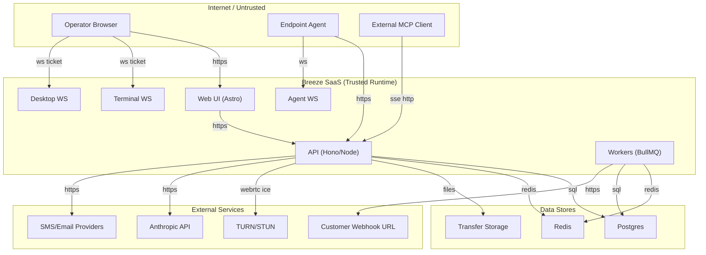

## Executive summary

Breeze is a shared, multi-tenant RMM where compromise of identity (JWTs, API keys, agent tokens) or a single authZ/tenant-isolation bug can directly translate into remote command execution, file exfiltration/modification, and cross-partner data access. Highest-risk areas are (1) tenant isolation enforcement in API handlers (ensuring every query/operation is org-scoped), (2) agent enrollment/authentication and remote session brokering (WebSockets + WebRTC), and (3) outward-facing automation surfaces (webhooks and MCP tool execution) that can become exfiltration or confused-deputy pathways. Evidence: broad API surface registered in `apps/api/src/index.ts`, agent enrollment + command queueing in `apps/api/src/routes/agents.ts`, remote access + file transfer in `apps/api/src/routes/remote.ts`, AI/MCP tool execution in `apps/api/src/routes/mcpServer.ts` and `apps/api/src/services/aiAgent.ts`.

## Scope and assumptions

In-scope paths:
- `apps/api/` (primary API and background workers; most security-critical logic)
- `apps/web/` (Astro frontend as primary operator UI; token handling assumptions)
- `agent/` (Go endpoint agent and enrollment/runtime configuration)
- `docker-compose.yml`, `docker-compose.dev.yml`, `docker-compose.test.yml` (deployment/security-relevant defaults)
- `packages/shared/` (shared validators/schemas that shape input validation)

Out-of-scope (explicit):
- `e2e-tests/`, `test-*.py` (test tooling; may contain insecure patterns not representative of prod)
- `monitoring/` and `docker/` except where they define exposed endpoints/secrets defaults
- `tools/remote-mcp/` (separate helper server; not part of the core SaaS runtime unless you deploy it)

Assumptions (based on your answers; these materially affect ranking):
- Deployment is a shared multi-tenant SaaS with multiple partners in one deployment (Partner → Organization → Site → Device). Evidence for intended hierarchy: `README.md`, `docs/architecture.md`.
- Agents authenticate with bearer tokens only (no mTLS/VPN/IP allowlists). Evidence: agent auth is `Authorization: Bearer brz_...` hashed against DB in `apps/api/src/middleware/agentAuth.ts`; agent WS token validation in `apps/api/src/routes/agentWs.ts`.
- Enrollment keys are short-lived and generated in the UI (returned once). Evidence: enrollment key generation/return in `apps/api/src/routes/enrollmentKeys.ts`.
- TLS termination exists in front of the API/Web; internal service-to-service traffic (API↔DB/Redis) is within a trusted network.
- Production secrets (JWT signing, secret encryption, enrollment-key pepper) are strong and rotated via standard SaaS ops. Evidence of required envs: `docker-compose.yml`, `apps/api/src/services/jwt.ts`, `apps/api/src/services/secretCrypto.ts`, `apps/api/src/services/enrollmentKeySecurity.ts`.

Open questions (would change priority if answered differently):
- Are there multiple API replicas (k8s/ASG) and do you use sticky sessions? This impacts in-memory WS tickets and connect codes in `apps/api/src/services/remoteSessionAuth.ts`.
- Are there any “system scope” users or internal automation that can call `/api/v1/system-tools/*` broadly, and how are those credentials protected?
- Are file transfers stored on local disk in production (`TRANSFER_STORAGE_PATH`) or on durable encrypted storage? Evidence: `apps/api/src/services/fileStorage.ts`.

## System model

### Primary components

- Web UI (Astro): operator console, talks to API over HTTP(S). Evidence: `README.md` (Astro + React islands).
- API (Node + Hono): REST + SSE + WebSockets; enforces authN/authZ, issues commands to agents, stores state in DB/Redis. Evidence: `apps/api/src/index.ts`.
- Postgres (Drizzle ORM): tenant data store (devices, sessions, alerts, audit logs, API keys, webhooks, etc.). Evidence: Drizzle usage throughout routes/services, e.g. `apps/api/src/middleware/auth.ts`, `apps/api/src/routes/agents.ts`.
- Redis (BullMQ + rate limiting + token revocation): job queue/workers; rate limiting; token revocation; some security checks fail-closed if Redis missing. Evidence: worker initialization in `apps/api/src/index.ts`; rate limiting `apps/api/src/services/rate-limit.ts`; token revocation `apps/api/src/services/tokenRevocation.ts`.
- Endpoint agent (Go): enrolls, heartbeats, executes commands, streams remote terminal/desktop data via agent WebSocket. Evidence: config template `agent/agent.yaml.example`; API endpoints `apps/api/src/routes/agents.ts`; WS server `apps/api/src/routes/agentWs.ts`.
- Remote access broker: terminal/desktop sessions via WebSockets + WebRTC ICE/TURN credentials. Evidence: `apps/api/src/routes/remote.ts`, `apps/api/src/routes/terminalWs.ts`, `apps/api/src/routes/desktopWs.ts`.
- AI surfaces:
  - In-app AI chat (SSE) with tool execution behind guardrails. Evidence: `apps/api/src/routes/ai.ts`, `apps/api/src/services/aiAgent.ts`, `apps/api/src/services/aiGuardrails.ts`, `apps/api/src/services/aiTools.ts`.
  - External MCP server (SSE + HTTP) authenticated by API keys with `ai:*` scopes. Evidence: `apps/api/src/routes/mcpServer.ts`, `apps/api/src/middleware/apiKeyAuth.ts`.
- Outbound integrations:
  - Webhook delivery worker (HTTP), with URL safety checks. Evidence: `apps/api/src/routes/webhooks.ts`, `apps/api/src/services/notificationSenders/webhookSender.ts`, `apps/api/src/workers/webhookDelivery` (referenced in `apps/api/src/index.ts`).
  - Email/SMS providers (Resend/nodemailer/Twilio). Evidence: deps in `apps/api/package.json`, services referenced in `apps/api/src/routes/auth.ts`.

### Data flows and trust boundaries

- Internet (operator browser) → Web UI
  - Data: UI content, auth tokens (access token in JS memory; refresh token cookie), org context.
  - Channel: HTTP(S).
  - Guarantees: assumed TLS; browser origin policy.
  - Evidence: `README.md` (web at `:4321`), refresh cookie logic `apps/api/src/routes/auth.ts`.

- Internet (operator browser / API client) → API (`/api/v1/*`)
  - Data: bearer `Authorization: Bearer <JWT>` plus JSON bodies/params.
  - Channel: HTTP(S).
  - Guarantees/controls: JWT verification (`HS256`), scope checks, optional per-route RBAC, org scoping via `auth.orgCondition` patterns. Evidence: `apps/api/src/services/jwt.ts`, `apps/api/src/middleware/auth.ts`.

- Internet (agent) → API (agent enrollment + telemetry endpoints)
  - Data: enrollment key + device metadata; later, agent bearer token for heartbeats/ingest.
  - Channel: HTTP(S).
  - Guarantees/controls: enrollment key validation; subsequent requests authenticated via `agentAuthMiddleware` (token hashed vs DB) + per-agent Redis rate limit (120/min). Evidence: enrollment in `apps/api/src/routes/agents.ts` (`POST /enroll`); auth middleware `apps/api/src/middleware/agentAuth.ts`.

- Internet (agent) → API (agent WebSocket `/api/v1/agent-ws`)
  - Data: agent token (query param) + command results/terminal output and binary frames.
  - Channel: WebSocket.
  - Guarantees/controls: token validation by hashing token and comparing to `devices.agentTokenHash`; device ownership check when writing command results (`deviceCommands` join `devices.agentId`). Evidence: `apps/api/src/routes/agentWs.ts` (`validateAgentToken`, `processCommandResult`).

- Internet (operator viewer) → API (terminal/desktop WebSockets)
  - Data: one-time WS ticket.
  - Channel: WebSocket.
  - Guarantees/controls: one-time ticket consumption (in-memory store, 60s TTL), checks session ownership (session.userId match), device online, agent connected. Evidence: ticket store `apps/api/src/services/remoteSessionAuth.ts`; enforcement `apps/api/src/routes/terminalWs.ts` and `apps/api/src/routes/desktopWs.ts`.

- API → Postgres
  - Data: tenant state, auth state (session records, API key hashes, agent token hashes), audit logs.
  - Channel: DB connection.
  - Guarantees/controls: application-layer tenant filtering (`auth.orgCondition`), role/permission checks in some routes. Evidence: `apps/api/src/middleware/auth.ts`, `apps/api/src/services/permissions.ts`.

- API/workers → Redis
  - Data: rate limit counters, token revocation state, job queues, MFA pending/setup.
  - Channel: Redis.
  - Guarantees/controls: multiple security checks fail-closed if Redis is missing (rate limiting, token revocation). Evidence: `apps/api/src/services/rate-limit.ts`, `apps/api/src/services/tokenRevocation.ts`, MFA setup in `apps/api/src/routes/auth.ts`.

- API/workers → Outbound HTTP (webhooks, PSA, Anthropic)
  - Data: alert payloads, org metadata, tool calls/prompts.
  - Channel: HTTP(S).
  - Guarantees/controls: webhook URL safety checks with DNS resolution and HTTPS requirement. Evidence: `apps/api/src/services/notificationSenders/webhookSender.ts`; webhook config handling in `apps/api/src/routes/webhooks.ts`; Anthropic client usage in `apps/api/src/services/aiAgent.ts`.

#### Diagram

## Assets and security objectives

| Asset | Why it matters | Security objective (C/I/A) |
|---|---|---|
| Tenant isolation boundary (partner/org/site scoping) | Cross-partner access is catastrophic in shared SaaS | C/I |
| User auth artifacts (JWT access tokens, refresh token cookie) | Enables RMM takeover within a tenant; lateral movement via remote tools | C |
| API keys (`brz_...`) | Headless access + MCP tool execution; often long-lived | C |
| Agent tokens (`brz_...` hashed on device record) | Agent impersonation enables command execution + data injection | C/I |
| Enrollment keys (returned once) | Leak enables rogue agent enrollment and new agent token issuance | C/I |
| Remote access sessions (terminal/desktop/file transfer) | Direct access to endpoints; high-impact confidentiality/integrity | C/I |
| Scripts/commands/automations | RCE-by-design; integrity critical (what runs on endpoints) | I |
| Webhook destinations and secrets | Exfiltration channel; SSRF-like outbound reach; secret leakage | C |
| Audit logs | Incident response and non-repudiation; attacker may attempt tampering | I/A |
| Availability-critical resources (API, Redis, DB, WS session capacity, disk for transfers) | Outage disables monitoring/remediation across tenants | A |

## Attacker model

### Capabilities

- Remote unauthenticated attacker can reach public HTTP endpoints and attempt credential stuffing, token guessing, and DoS.
- Malicious or compromised tenant user (organization/partner scope) can call API endpoints they are authorized for and attempt horizontal/vertical privilege escalation.
- Attacker with a leaked API key can call `/api/v1/mcp/*` and any other API-key-enabled surfaces (depending on scopes). Evidence: API key auth `apps/api/src/middleware/apiKeyAuth.ts`; MCP routes `apps/api/src/routes/mcpServer.ts`.
- Attacker who compromises an agent host can extract its agent token from local config and impersonate the agent to the API/WS. Evidence: agent config includes `auth_token` in `agent/agent.yaml.example`; agent auth expects bearer token in `apps/api/src/middleware/agentAuth.ts`.
- Attacker can register webhook endpoints they control (within their tenant) and receive event payloads from Breeze. Evidence: webhook CRUD `apps/api/src/routes/webhooks.ts`.

### Non-capabilities

- No assumed database/Redis admin access.
- No assumed ability to MITM TLS between clients/agents and the API (unless tokens are already compromised).
- No assumed ability to execute code on the API host/container without first exploiting an application bug or obtaining privileged credentials.

## Entry points and attack surfaces

| Surface | How reached | Trust boundary | Notes | Evidence (repo path / symbol) |
|---|---|---|---|---|
| Auth endpoints | `/api/v1/auth/*` | Internet → API | JWT issuance; refresh token cookie rotation with CSRF header checks | `apps/api/src/routes/auth.ts` (`/refresh`, `validateCookieCsrfRequest`) |
| Agent enrollment | `POST /api/v1/agents/enroll` | Internet → API | Unauthenticated beyond enrollment key; issues new agent token | `apps/api/src/routes/agents.ts` (`agentRoutes.post('/enroll'...)`) |
| Agent telemetry ingestion | `POST /api/v1/agents/:id/*` | Internet → API | Agent bearer auth + per-agent rate limiting | `apps/api/src/middleware/agentAuth.ts` |
| Agent WebSocket | `/api/v1/agent-ws` | Internet → API | Agent token in WS handshake; command result ingestion | `apps/api/src/routes/agentWs.ts` (`validateAgentToken`, `processCommandResult`) |
| Remote sessions API | `/api/v1/remote/*` | Internet → API | Creates/controls remote sessions and file transfers | `apps/api/src/routes/remote.ts` |
| Terminal WS | `/api/v1/remote/sessions/*` (WS) | Internet → API | One-time WS ticket; session ownership checks | `apps/api/src/routes/terminalWs.ts` (`validateTerminalAccess`, `consumeWsTicket`) |
| Desktop WS | `/api/v1/desktop-ws/*` (WS) | Internet → API | One-time WS ticket; relays binary frames | `apps/api/src/routes/desktopWs.ts` |
| System tools | `/api/v1/system-tools/*` | Internet → API | High-power device operations (file read/write/upload, registry edits, process kill, etc.) | `apps/api/src/routes/systemTools.ts` (e.g. `/devices/:deviceId/files/upload`) |
| Webhooks (config) | `/api/v1/webhooks/*` | Internet → API | Stores outbound destinations + secrets | `apps/api/src/routes/webhooks.ts`, `apps/api/src/services/secretCrypto.ts` |
| Webhooks (delivery) | Worker outbound HTTP | API → Internet | Potential exfil channel; URL safety checks | `apps/api/src/services/notificationSenders/webhookSender.ts` |
| AI chat (in-app) | `/api/v1/ai/*` (SSE) | Internet → API | Tool execution behind guardrails + RBAC | `apps/api/src/routes/ai.ts`, `apps/api/src/services/aiAgent.ts`, `apps/api/src/services/aiGuardrails.ts` |
| MCP server (external) | `/api/v1/mcp/*` (SSE + POST) | Internet → API | API key auth with `ai:*` scopes; production allowlist for destructive tools | `apps/api/src/routes/mcpServer.ts` (`isExecuteToolAllowedInProd`) |
| Metrics scrape | `GET /metrics/scrape` | Internet → API | Bearer token distinct from JWT; must not be exposed broadly | `apps/api/src/routes/metrics.ts` (`/scrape`, `METRICS_SCRAPE_TOKEN`) |

## Top abuse paths

1. Cross-partner takeover via authZ/tenant isolation bug
   1. Attacker signs in as a low-privileged user in Partner A.
   2. Attacker calls an API route that accepts `orgId`/`deviceId` and is missing an `auth.orgCondition(...)` filter or `requireOrgAccess(...)`.
   3. Attacker accesses/modifies Partner B’s devices/scripts/sessions.
   4. Impact: cross-tenant data exfiltration + remote command execution. Evidence anchor for intended control: `apps/api/src/middleware/auth.ts` (`orgCondition`, `canAccessOrg`).

2. Rogue agent enrollment from leaked short-lived enrollment key
   1. Attacker obtains an enrollment key from UI leakage, logs, or a compromised tech account.
   2. Attacker calls `POST /api/v1/agents/enroll` and receives a new agent token (`authToken`).
   3. Attacker uses the token to connect via agent WS and impersonate a device, accepting commands and returning crafted outputs.
   4. Impact: endpoint compromise workflows, false telemetry, and potential lateral movement. Evidence: `apps/api/src/routes/agents.ts` enrollment issues `authToken`.

3. Agent token theft → impersonation and command/result spoofing
   1. Attacker compromises an endpoint and reads `auth_token` from agent config.
   2. Attacker authenticates to `/:id/*` agent endpoints or `/api/v1/agent-ws`.
   3. Attacker submits forged `command_result` or telemetry to corrupt monitoring and mislead operators.
   4. Impact: integrity loss and possible escalation through operator actions. Evidence: `apps/api/src/middleware/agentAuth.ts`, `apps/api/src/routes/agentWs.ts`.

4. External MCP client key leak → high-impact tool execution
   1. Attacker steals an API key with `ai:*` scopes.
   2. Attacker opens `/api/v1/mcp/sse` and issues `tools/call` messages.
   3. If production allowlist is misconfigured (`MCP_EXECUTE_TOOL_ALLOWLIST` too broad), attacker triggers destructive tools (e.g., command execution, file operations).
   4. Impact: remote execution across devices in a tenant. Evidence: `apps/api/src/routes/mcpServer.ts` (`requireApiKeyScope`, allowlist check), guardrails `apps/api/src/services/aiGuardrails.ts`.

5. Webhook as an exfiltration channel (intentional but must be controlled)
   1. Attacker with tenant admin rights configures a webhook to an attacker-controlled HTTPS domain.
   2. Breeze delivers alert payloads (including org/device identifiers and context) to attacker endpoint.
   3. Impact: sensitive data exfiltration and operational intel leakage. Evidence: webhook delivery payload assembly `apps/api/src/services/notificationSenders/webhookSender.ts`, webhook CRUD `apps/api/src/routes/webhooks.ts`.

6. File transfer poisoning via missing ownership enforcement
   1. User A starts an upload transfer (creates transfer record) and expects to download the result later.
   2. Malicious User B (same org) calls `POST /api/v1/remote/transfers/:id/chunks` for User A’s transfer (no ownership check visible in handler).
   3. User A downloads a tampered file via `GET /api/v1/remote/transfers/:id/download`.
   4. Impact: integrity compromise and potential endpoint compromise if files are executed. Evidence: chunk upload handler in `apps/api/src/routes/remote.ts` (no `hasSessionOrTransferOwnership` check in that route).

7. Availability degradation via WS/SSE session exhaustion
   1. Attacker repeatedly opens agent WS, terminal/desktop WS, and MCP SSE sessions.
   2. Server memory/session caps are hit (e.g., MCP `MAX_SSE_SESSIONS = 100`), degrading service for all tenants.
   3. Impact: platform-wide outage. Evidence: MCP session cap in `apps/api/src/routes/mcpServer.ts`; in-memory ticket stores `apps/api/src/services/remoteSessionAuth.ts`.

## Threat model table

| Threat ID | Threat source | Prerequisites | Threat action | Impact | Impacted assets | Existing controls (evidence) | Gaps | Recommended mitigations | Detection ideas | Likelihood | Impact severity | Priority |
|---|---|---|---|---|---|---|---|---|---|---|---|---|
| TM-001 | Malicious tenant user | Valid JWT in any tenant | Exploit missing org scoping or missing authZ checks to access/modify other orgs/partners | Cross-tenant data breach; remote control of endpoints | Tenant isolation boundary; devices; scripts; remote sessions | Org scoping helpers exist (`orgCondition`, `canAccessOrg`) in `apps/api/src/middleware/auth.ts` | Enforcement is per-handler; easy to miss filters on new routes/joins; mixed patterns across routes | Add a centralized “org scoping required” pattern: helper to build scoped queries; add tests that assert cross-org denial for every route; consider DB-level RLS keyed by `org_id` | Audit log anomalies: requests where `orgId` in path/query differs from `auth.orgId`; alert on repeated 403s across orgs | Medium | High | critical |
| TM-002 | External attacker | Leaked JWT access/refresh token or API key (phishing, XSS, logs) | Use stolen tokens to call high-privilege APIs and run remote actions | Tenant takeover; endpoint compromise | JWTs/refresh cookie; API keys; remote access sessions; scripts | JWT verification (`apps/api/src/services/jwt.ts`); refresh rotation + CSRF checks (`apps/api/src/routes/auth.ts`); token revocation fails-closed on Redis loss (`apps/api/src/services/tokenRevocation.ts`) | Token-only model; no device binding; unclear MFA enforcement for all accounts; API keys can be long-lived | Enforce MFA for privileged roles; shorten refresh lifetime for admins; add optional IP/ASN heuristics; add API key rotation + scoped least-privilege defaults | Alert on new geo/IP for same user; alert on API key usage spikes; log `actorType` and sensitive actions | Medium | High | critical |
| TM-003 | External attacker / malicious tech | Enrollment key obtained (short-lived but exposed once) | Enroll rogue agent and obtain agent auth token | Device impersonation; integrity compromise; possible command execution pathways | Enrollment keys; agent tokens; device inventory | Enrollment keys are hashed with pepper (`apps/api/src/services/enrollmentKeySecurity.ts`) and generated server-side (`apps/api/src/routes/enrollmentKeys.ts`) | Enrollment endpoint accepts enrollment key alone; `AGENT_ENROLLMENT_SECRET` is required by docker compose but not evidently used in enrollment handler (`apps/api/src/routes/agents.ts`) | Treat enrollment keys as one-time by default; enforce short TTL in DB; require proof-of-possession step (device nonce signed by org-specific secret) or secondary enrollment secret bound to site; ensure UI never logs keys | Audit on enrollment events (`agent.enroll` already written); alert on spikes or enrollments from unusual ASN/country | Medium | High | high |
| TM-004 | Compromised endpoint | Ability to read agent config | Use agent token to call agent endpoints and WS; spoof telemetry or `command_result` | Monitoring integrity loss; operator misremediation; possible remote access confusion | Agent tokens; device state; audit logs | Agent bearer auth hashes tokens (`apps/api/src/middleware/agentAuth.ts`); WS token validation uses stored hash (`apps/api/src/routes/agentWs.ts`) | No mTLS; token is a static bearer; compromised endpoint can impersonate indefinitely until rotated | Add agent token rotation with server-initiated rekey; optionally bind token to device public key; add anomaly detection for agent IP changes | Alert when an agent’s source IP/ASN changes abruptly; alert on mismatched device fingerprints | Medium | Medium | high |
| TM-005 | Malicious tenant user | Ability to configure webhook | Use webhook as exfil channel or attempt outbound reach | Data exfil; potential abuse of outbound network (not private-net SSRF due to checks) | Webhook payloads; secrets | URL safety validation blocks localhost/private IP and requires HTTPS, including DNS resolution checks (`apps/api/src/services/notificationSenders/webhookSender.ts`); webhook secrets encrypted at rest (`apps/api/src/services/secretCrypto.ts`) | DNS rebinding/TOCTOU and future IP changes; payload may contain more data than intended; secrets may be decrypted in worker memory | Re-resolve DNS at send time (already done); pin to resolved IPs with TTL; minimize payload fields; add per-org allowlist for webhook domains | Log webhook delivery target host (redacted) and failures; alert on repeated failures/timeouts | Medium | Medium | medium |
| TM-006 | Malicious tenant user | Valid JWT in same org | Poison another user’s file transfer by uploading chunks to their transfer ID | Integrity compromise; social engineering vector | Remote session/file transfer artifacts | Transfer size limit enforced (`MAX_TRANSFER_SIZE_BYTES`) in `apps/api/src/routes/remote.ts`; local chunk assembly in `apps/api/src/services/fileStorage.ts` | Chunk upload route appears to lack `hasSessionOrTransferOwnership` check, unlike other transfer endpoints (`apps/api/src/routes/remote.ts`) | Enforce ownership (or agent-only/system-only) for chunk upload; bind upload to a signed upload token tied to transfer/user; store transfers in per-tenant bucket with checksum | Audit chunk uploads (who uploaded, transferId); alert on chunks from different user than transfer owner | Medium | Medium | high |
| TM-007 | External attacker | API key with `ai:*` scopes | Abuse MCP to enumerate tools/resources and call tools; bypass human approval if allowlist is permissive | Remote command execution (tenant-scoped) | Devices; scripts; automations | API-key auth + per-key rate limit (`apps/api/src/middleware/apiKeyAuth.ts`); production allowlist for destructive tools (`apps/api/src/routes/mcpServer.ts`) | Allowlist misconfiguration becomes a single knob for high-impact access; global SSE session cap can be abused | Default deny destructive tools in production (already); add separate “mcp-admin” scope for any Tier 3 tools; add per-key concurrent SSE caps | Audit `mcp.*` actions (already); alert on `tools/call` rate and failed guardrail checks | Medium | High | high |
| TM-008 | External attacker | Internet access | DoS via request floods, WS/SSE session exhaustion, or agent heartbeat floods | Platform outage | Availability-critical resources | Multiple fail-closed rate limits rely on Redis (`apps/api/src/services/rate-limit.ts`); per-agent rate limit (120/min) in `apps/api/src/middleware/agentAuth.ts`; MCP session cap in `apps/api/src/routes/mcpServer.ts` | Many endpoints have no explicit rate limiting; in-memory stores can be pressured; transfer storage may fill disk | Add gateway/WAF rate limiting; enforce per-user and per-org concurrency caps for WS sessions; cap number of active transfers per org; ensure transfer storage is bounded and garbage-collected | Metrics and alerts on WS connection counts, SSE sessions, transfer disk usage; 429 rates; Redis latency | High | Medium | high |
| TM-009 | External attacker | `METRICS_SCRAPE_TOKEN` leak or exposed endpoint | Scrape internal metrics (may include org IDs, route names) | Info leak aiding further attacks | Telemetry; org identifiers | `/metrics/scrape` requires bearer token (`apps/api/src/routes/metrics.ts`); other metrics endpoints require JWT + scope | Token distribution/rotation risk; endpoint might be internet-exposed in SaaS | Place `/metrics/scrape` behind internal network only; rotate token regularly; remove org identifiers from labels if not needed | Alert on unexpected scrape sources; audit logs for /metrics/scrape requests at edge proxy | Low | Medium | medium |
| TM-010 | Malicious tenant user / compromised admin | Elevated permissions in tenant | Abuse system tools / command execution / file operations to perform destructive actions | Endpoint compromise by design | Devices; scripts; files | AI guardrails tiering + RBAC for tools (`apps/api/src/services/aiGuardrails.ts`); command execution is mediated via queue/agent (`apps/api/src/services/commandQueue` referenced by tools) | Non-AI endpoints (e.g., system tools) may not have consistent permission checks beyond scope; “system-tools” are inherently high-risk | Ensure system-tools endpoints require explicit `devices.execute` permission (not just scope); add maintenance windows and just-in-time elevation for destructive actions | Alert on high-risk actions (file write/upload, process kill, registry writes); include `actorId`, `deviceId`, and org in audit logs | Medium | High | high |

## Criticality calibration

For this shared multi-tenant SaaS, calibrate severity as:
- critical: cross-partner/org isolation breaks; auth bypass; token/key compromise that enables remote command execution across endpoints; any path that turns “read-only” access into “execute”.
  - Examples: TM-001 cross-tenant access; TM-002 stolen admin JWT; TM-007 MCP allowlist misconfig enabling destructive tools at scale.
- high: single-tenant compromise with endpoint control; agent impersonation; workflows that allow remote code execution but require additional preconditions (key leak, enrollment key leak).
  - Examples: TM-003 rogue enrollment; TM-004 agent token theft; TM-010 abusive use of high-power endpoints after privilege escalation.
- medium: meaningful data exposure or integrity issues within a tenant; exfiltration channels with strong constraints; targeted DoS with mitigations available.
  - Examples: TM-005 webhook exfil; TM-009 metrics scrape token leak.
- low: low-sensitivity leaks, noisy DoS, issues requiring unlikely preconditions or strong existing compensating controls.

## Focus paths for security review

| Path | Why it matters | Related Threat IDs |
|---|---|---|
| `apps/api/src/middleware/auth.ts` | Core JWT auth context, scope/permission gates, org scoping primitives | TM-001, TM-002, TM-010 |
| `apps/api/src/services/jwt.ts` | JWT signing/verification and token shape | TM-002 |
| `apps/api/src/services/tokenRevocation.ts` | Fail-closed revocation logic; Redis dependency | TM-002, TM-008 |
| `apps/api/src/routes/agents.ts` | Enrollment, heartbeats, command queueing; device identity issuance | TM-003, TM-004, TM-008 |
| `apps/api/src/middleware/agentAuth.ts` | Agent bearer authentication + rate limiting | TM-004, TM-008 |
| `apps/api/src/routes/agentWs.ts` | Agent WS authentication and command result ingestion | TM-004, TM-008 |
| `apps/api/src/routes/remote.ts` | Remote sessions + file transfers; ownership and authZ pitfalls | TM-001, TM-006, TM-008 |
| `apps/api/src/services/remoteSessionAuth.ts` | In-memory WS tickets/connect codes; multi-replica implications | TM-002, TM-008 |
| `apps/api/src/routes/terminalWs.ts` | Terminal WS access checks and agent relay | TM-002, TM-008 |
| `apps/api/src/routes/desktopWs.ts` | Desktop WS access checks and binary frame relay | TM-002, TM-008 |
| `apps/api/src/routes/mcpServer.ts` | External MCP interface; allowlist + rate limits | TM-007, TM-008 |
| `apps/api/src/services/aiAgent.ts` | Tool dispatch, guardrails integration, audit logging | TM-007, TM-010 |
| `apps/api/src/services/aiGuardrails.ts` | Tiering, RBAC mapping, per-tool rate limits | TM-007, TM-010 |
| `apps/api/src/routes/webhooks.ts` | Webhook CRUD, secret encryption/decryption lifecycle | TM-005 |
| `apps/api/src/services/notificationSenders/webhookSender.ts` | Outbound URL safety and DNS resolution checks | TM-005 |
| `apps/api/src/services/fileStorage.ts` | Transfer storage path and assembly; disk exhaustion risks | TM-006, TM-008 |
| `apps/api/src/routes/metrics.ts` | Metrics exposure and scrape token endpoint | TM-009 |
| `docker-compose.yml` | Production defaults and required secrets; exposed services | TM-002, TM-008, TM-009 |

**Quality check**
- Covered entry points: auth, agent enrollment/telemetry/WS, remote sessions/WS, system-tools, webhooks, AI chat, MCP, metrics scrape.
- Covered trust boundaries: Internet→API, Agent→API, API→DB/Redis, API→Outbound HTTP, WebSocket/SSE boundaries.
- Runtime vs CI/dev: focused on `apps/api`, `agent`, deployment files; excluded tests/tools as out-of-scope.
- Reflected your clarifications: shared multi-tenant SaaS; agent token-only; UI-generated short-lived enrollment keys.
- Assumptions/open questions are explicit in “Scope and assumptions”.

