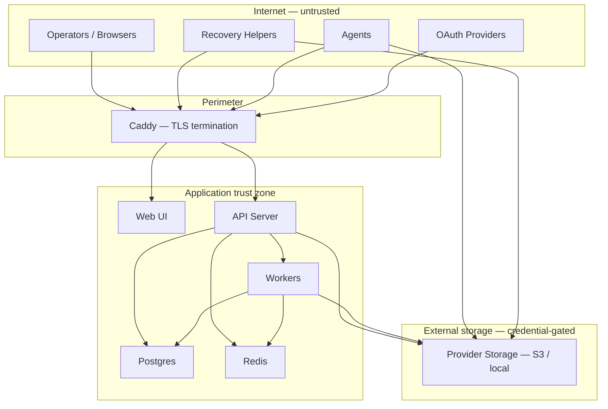

# Breeze Backup / Recovery Threat Model

## Executive summary

The highest-risk remaining themes in this repository are now narrower than the original review: inconsistent command-result validation on the agent WebSocket control plane, global enrollment-secret trust at the public enrollment boundary, bearer-style recovery token abuse for one-device snapshot scope, and policy/regression risks around org isolation and legacy unsigned artifacts. Several formerly high-risk infrastructure issues — long-lived unrotated agent tokens, unauthenticated Redis assumptions, queue-payload trust, runtime helper-binary provenance, boot-template provenance, and state-only OAuth callback trust — have been materially reduced or mitigated and are documented below. The most important remaining open attack classes are agent result forgery for critical command types, rogue enrollment with leaked deployment-wide material, and operational trust downgrade through legacy recovery outputs.

## Scope and assumptions

- In scope:
  - `/Users/toddhebebrand/breeze/apps/api/src/routes/backup`
  - `/Users/toddhebebrand/breeze/apps/api/src/routes/agents`
  - `/Users/toddhebebrand/breeze/apps/api/src/routes/c2c`
  - `/Users/toddhebebrand/breeze/apps/api/src/routes/dr.ts`
  - `/Users/toddhebebrand/breeze/apps/api/src/routes/agentWs.ts`
  - `/Users/toddhebebrand/breeze/apps/api/src/services/recoveryBootstrap.ts`
  - `/Users/toddhebebrand/breeze/apps/api/src/services/recoveryDownloadService.ts`
  - `/Users/toddhebebrand/breeze/apps/api/src/services/recoveryMediaService.ts`
  - `/Users/toddhebebrand/breeze/apps/api/src/services/recoveryBootMediaService.ts`
  - `/Users/toddhebebrand/breeze/apps/api/src/services/commandQueue.ts`
  - `/Users/toddhebebrand/breeze/apps/api/src/jobs`
  - `/Users/toddhebebrand/breeze/docker-compose.yml`
- Out of scope:
  - Full CI/release workflow details except where they affect runtime artifact trust.
  - Endpoint implementation detail outside backup/recovery/agent/C2C/DR surfaces.
- Explicit assumptions:
  - The API is internet-facing behind Caddy with public TLS termination and no default VPN/IP allowlist boundary, based on [`docker-compose.yml`](/Users/toddhebebrand/breeze/docker-compose.yml).
  - Deployments are typically self-hosted per customer, but each deployment is multi-tenant across partners and organizations, so org isolation is still a hard security property.
  - Backup snapshots, MSSQL backups, BMR state, and C2C data may contain highly sensitive customer data.
  - Agents and recovery helpers are managed but compromise of one endpoint or leaked token is in scope.
  - Redis and workers run inside the same deployment trust zone as the API, but compromise of Redis or internal job injection is a meaningful attacker path.
- Open questions that would materially change ranking:
  - Whether production Redis is normally isolated to a private network segment beyond the default compose topology.
  - Whether helper binaries are always sourced from pinned local artifacts in production or commonly from GitHub runtime download.
  - Whether any deployments disable public recovery endpoints in front of an additional gateway.

## System model

### Primary components

- Internet-facing reverse proxy:
  - Caddy terminates TLS and routes `/api/*` to the Node API and everything else to the web UI in [`docker-compose.yml`](/Users/toddhebebrand/breeze/docker-compose.yml).
- API server:
  - Hono app mounting authenticated and public backup, agent, C2C, and DR routes at `/api/v1` in [`index.ts`](/Users/toddhebebrand/breeze/apps/api/src/index.ts).
- Authenticated operator web UI:
  - Web app calls backup/recovery routes and exposes recovery bootstrap and media flows in [`RecoveryBootstrapTab.tsx`](/Users/toddhebebrand/breeze/apps/web/src/components/backup/RecoveryBootstrapTab.tsx).
- Public recovery helper flow:
  - Token-based BMR authenticate/download/complete routes mounted before JWT auth in [`index.ts`](/Users/toddhebebrand/breeze/apps/api/src/routes/backup/index.ts) and implemented in [`bmr.ts`](/Users/toddhebebrand/breeze/apps/api/src/routes/backup/bmr.ts).
- Agents:
  - Public enrollment route plus agent Bearer-token-authenticated REST routes in [`routes/agents/index.ts`](/Users/toddhebebrand/breeze/apps/api/src/routes/agents/index.ts), [`routes/agents/enrollment.ts`](/Users/toddhebebrand/breeze/apps/api/src/routes/agents/enrollment.ts), and [`middleware/agentAuth.ts`](/Users/toddhebebrand/breeze/apps/api/src/middleware/agentAuth.ts).
- Agent WebSocket control plane:
  - Device command/result channel in [`agentWs.ts`](/Users/toddhebebrand/breeze/apps/api/src/routes/agentWs.ts).
- Workers and queue:
  - BullMQ-backed workers share process/runtime trust with the API in [`index.ts`](/Users/toddhebebrand/breeze/apps/api/src/index.ts), including backup SLA, DR execution, recovery media, and boot media workers.
- Data stores:
  - Postgres for authoritative state, Redis for rate limits and queues, provider-backed storage for snapshots/artifacts.

### Data flows and trust boundaries

- Internet -> Caddy reverse proxy
  - Data: browser traffic, public API calls, agent enrollment, recovery token calls.
  - Channel: HTTPS.
  - Security guarantees: TLS, basic security headers at proxy.
  - Validation: none at proxy beyond path routing.
- Browser / operator API client -> API server
  - Data: JWT-authenticated org-scoped backup, vault, DR, C2C, and recovery-media operations.
  - Channel: HTTPS JSON.
  - Security guarantees: JWT auth, org/partner scope middleware, route-level permission checks, MFA on sensitive writes in many backup routes.
  - Validation: Zod schemas, route-specific org scoping, rate limits on some surfaces.
- Public recovery helper -> BMR public endpoints
  - Data: recovery token, download descriptor requests, restore completion state.
  - Channel: HTTPS JSON plus artifact download.
  - Security guarantees: bearer-like recovery token capability, public IP rate limits, audit logging.
  - Validation: token hash lookup, expiry/session checks, path scoping in recovery download service.
- Agent installer / new device -> `/agents/enroll`
  - Data: enrollment key, optional enrollment secret, device identity and hardware metadata.
  - Channel: HTTPS JSON.
  - Security guarantees: hashed enrollment key, optional global enrollment secret in production.
  - Validation: key expiry/usage checks, some transactional limit checks, no user JWT.
- Agent -> authenticated REST + WebSocket control plane
  - Data: long-lived device bearer token, command polling/heartbeat, command results, telemetry.
  - Channel: HTTPS + WebSocket.
  - Security guarantees: SHA-256 token comparison, per-agent rate limiting, org-scoped DB context after auth.
  - Validation: token prefix check, timing-safe hash comparison, Zod schemas for messages.
- API/workers -> Postgres and Redis
  - Data: queue jobs, rate-limit counters, backup/recovery metadata, commands, tokens, artifacts.
  - Channel: internal TCP.
  - Security guarantees: same deployment trust zone; no separate application-layer isolation.
  - Validation: application logic only.
- API/workers/recovery helper -> provider-backed storage
  - Data: snapshot files, recovery bundles, bootable media, vaulted copies.
  - Channel: S3/local filesystem abstractions.
  - Security guarantees: provider credentials or proxy descriptors; signed recovery artifacts for new media.
  - Validation: path scoping and provider config resolution, limited artifact status checks.
- Public OAuth provider -> C2C callback
  - Data: OAuth state, tenant id, admin consent response.
  - Channel: HTTPS redirect query params.
  - Security guarantees: state token in DB with expiry and single-use delete.
  - Validation: state lookup/consume, callback parameter checks, token acquisition and Graph probe.

#### Diagram

```mermaid
flowchart TD
  subgraph "Internet — untrusted"
    I["Operators / Browsers"]
    J["Recovery Helpers"]
    K["Agents"]
    L["OAuth Providers"]
  end
  subgraph "Perimeter"
    B["Caddy — TLS termination"]
  end
  subgraph "Application trust zone"
    C["Web UI"]
    D["API Server"]
    G["Workers"]
    E["Postgres"]
    F["Redis"]
  end
  subgraph "External storage — credential-gated"
    H["Provider Storage — S3 / local"]
  end
  I --> B
  J --> B
  K --> B
  L --> B
  B --> C
  B --> D
  D --> E
  D --> F
  D --> G
  D --> H
  G --> E
  G --> F
  G --> H
  K --> H
  J --> H
```

## Assets and security objectives

| Asset | Why it matters | Security objective (C/I/A) |
| --- | --- | --- |
| Backup snapshot contents | Can contain full system data, MSSQL databases, email/workspace content, and secrets | C, I |
| Recovery tokens | Capability tokens for recovery bootstrap and snapshot access | C, I |
| Agent bearer tokens | Per-device control-plane credentials for commands and telemetry | C, I |
| Enrollment secret and enrollment keys | Gate public agent enrollment | C, I |
| Recovery bundles and bootable media | Integrity-critical recovery tooling that can become a persistence or destructive execution vector | I, A |
| Provider-backed storage credentials/descriptors | Enable direct access to snapshot and artifact storage | C, I |
| Org-scoped metadata in Postgres | Governs visibility, tenancy, restore history, policies, and DR state | C, I |
| Redis queue/rate-limit state | Drives job execution and can influence privileged worker actions | I, A |
| Audit logs | Required for incident response and tenant accountability | I, A |

## Attacker model

### Capabilities

- External internet attacker can reach Caddy-exposed API routes, including public BMR recovery endpoints, agent enrollment, and OAuth callbacks.
- Authenticated but low-privilege user or partner-scoped user can probe for org-isolation mistakes and IDOR-style access across backup/recovery/media/DR/C2C surfaces.
- Compromised managed endpoint can use its valid agent token to act as that device and submit forged command results.
- Possessor of a valid recovery token can invoke public recovery endpoints until expiry/revocation.
- Attacker with internal network or deployment compromise may tamper with Redis, local provider paths, or runtime artifact sources.
- Supply-chain attacker who compromises the runtime helper-binary source can influence generated recovery bundles if GitHub runtime download is used.

### Non-capabilities

- A compromised device token does not automatically grant access to other devices if route-level device-ID binding holds — i.e. the authenticated device ID is checked against the URL `:id` parameter in [`agentAuth.ts`](/Users/toddhebebrand/breeze/apps/api/src/middleware/agentAuth.ts). This non-capability depends on consistent enforcement; any route that omits the device-ID match check would break the isolation.
- Cross-deployment compromise is not in scope because deployments are assumed separate per customer.
- Arbitrary public callers do not have direct access to most backup routes because authenticated routes are mounted after auth middleware in [`backup/index.ts`](/Users/toddhebebrand/breeze/apps/api/src/routes/backup/index.ts).

## Entry points and attack surfaces

| Surface | How reached | Trust boundary | Notes | Evidence (repo path / symbol) |
| --- | --- | --- | --- | --- |
| `POST /api/v1/backup/bmr/recover/authenticate` | Public HTTPS | Internet -> API | Token-authenticated bootstrap/session creation | [`bmr.ts`](/Users/toddhebebrand/breeze/apps/api/src/routes/backup/bmr.ts) `bmrPublicRoutes.post('/bmr/recover/authenticate')` |
| `GET /api/v1/backup/bmr/recover/download` | Public HTTPS | Internet -> API -> provider storage | Scoped recovery download broker | [`bmr.ts`](/Users/toddhebebrand/breeze/apps/api/src/routes/backup/bmr.ts), [`recoveryDownloadService.ts`](/Users/toddhebebrand/breeze/apps/api/src/services/recoveryDownloadService.ts) |
| `POST /api/v1/backup/bmr/recover/complete` | Public HTTPS | Internet -> API -> DB | Finalizes restore job state | [`bmr.ts`](/Users/toddhebebrand/breeze/apps/api/src/routes/backup/bmr.ts) |
| `POST /api/v1/agents/enroll` | Public HTTPS | Internet -> API -> DB | Public enrollment with enrollment key + optional secret | [`enrollment.ts`](/Users/toddhebebrand/breeze/apps/api/src/routes/agents/enrollment.ts) |
| Agent REST `/:id/*` | HTTPS Bearer | Agent -> API | Device-authenticated privileged surfaces | [`routes/agents/index.ts`](/Users/toddhebebrand/breeze/apps/api/src/routes/agents/index.ts), [`agentAuth.ts`](/Users/toddhebebrand/breeze/apps/api/src/middleware/agentAuth.ts) |
| Agent WebSocket | WebSocket | Agent -> API | Command/result stream with device trust | [`agentWs.ts`](/Users/toddhebebrand/breeze/apps/api/src/routes/agentWs.ts) |
| `GET /api/v1/c2c/m365/callback` | Public HTTPS redirect | OAuth provider -> API | Single-use consent session consume path | [`m365Auth.ts`](/Users/toddhebebrand/breeze/apps/api/src/routes/c2c/m365Auth.ts) |
| Authenticated backup/recovery/media routes | JWT HTTPS | Operator -> API | Org-scoped restore, token, media, vault, DR flows | [`backup/index.ts`](/Users/toddhebebrand/breeze/apps/api/src/routes/backup/index.ts), [`bmr.ts`](/Users/toddhebebrand/breeze/apps/api/src/routes/backup/bmr.ts), [`dr.ts`](/Users/toddhebebrand/breeze/apps/api/src/routes/dr.ts) |
| Recovery bundle worker | BullMQ job | API -> worker -> provider storage | Builds and signs helper bundles from runtime binary source | [`recoveryMediaService.ts`](/Users/toddhebebrand/breeze/apps/api/src/services/recoveryMediaService.ts), [`recoveryMediaWorker.ts`](/Users/toddhebebrand/breeze/apps/api/src/jobs/recoveryMediaWorker.ts) |
| Boot media worker | BullMQ job | API -> worker -> local template/provider storage | Builds and signs ISO artifacts from signed bundles and a local base template | [`recoveryBootMediaService.ts`](/Users/toddhebebrand/breeze/apps/api/src/services/recoveryBootMediaService.ts), [`recoveryBootMediaWorker.ts`](/Users/toddhebebrand/breeze/apps/api/src/jobs/recoveryBootMediaWorker.ts) |
| Redis job/rate-limit state | Internal TCP | API/workers -> Redis | Shared trust zone, no app-layer queue auth | [`index.ts`](/Users/toddhebebrand/breeze/apps/api/src/index.ts), [`docker-compose.yml`](/Users/toddhebebrand/breeze/docker-compose.yml) |

## Top abuse paths

### Open abuse paths

1. **Scoped download exfiltration (TM-001):** Attacker with a valid recovery token uses the scoped download flow within the session TTL to pull snapshot contents for one device.
2. **Rogue agent enrollment (TM-003):** Attacker steals `AGENT_ENROLLMENT_SECRET` and a valid enrollment key -> enrolls a rogue agent into a chosen org -> receives long-lived device credentials and begins polling command surfaces for that org.
3. **Agent result forgery (TM-004):** Compromised endpoint with a valid agent token connects over REST/WebSocket -> submits forged command results or consumes device-scoped commands -> poisons restore/DR/vault/job state. Long-lived tokens with no rotation increase the window.
4. **Queue injection (TM-005):** Attacker tampers with Redis (no auth configured) or injects crafted BullMQ jobs inside the deployment trust zone -> recovery/media/DR workers execute privileged operations or write malicious state to Postgres.
5. **Supply-chain bundle compromise (TM-006):** Runtime bundle worker pulls a compromised helper binary from GitHub release assets -> signs and publishes a malicious recovery bundle as trusted.
6. **Boot-media template tampering (TM-007):** Attacker tampers with the boot-media base template directory or local provider storage -> worker builds a signed ISO containing malicious startup content.
7. **OAuth callback abuse (TM-008):** OAuth attacker reuses or forges a valid Microsoft consent `state` -> callback creates a malicious or cross-org C2C connection -> customer cloud data becomes accessible under attacker-controlled tenancy.

### Mitigated abuse paths

8. ~~**Direct provider credential theft (TM-001a):**~~ `buildAuthenticatedBootstrapPayload` filters provider config to safe metadata fields only; raw credentials never returned. Recovery helpers use the `/download` proxy endpoint with pre-signed URLs.
9. ~~**C2C credential theft from database (TM-010):**~~ All OAuth secrets encrypted with AES-256-GCM via `secretCrypto.ts` on all write paths; startup backfill migrates legacy plaintext rows; API responses exclude secret fields.
10. ~~**Cross-org access (TM-002):**~~ Code review verified consistent `resolveScopedOrgId` + `eq(orgId)` pattern across all authenticated routes. Remains a regression risk — negative tenancy tests recommended.
11. ~~**Recovery denial via fabricated completion (TM-011):**~~ Transaction with `onConflictDoNothing`, full result metadata persistence, and audit logging on the `/complete` endpoint. Remaining risk (bearer token trust) is inherent to Model B design.

## Threat model table

| Threat ID | Threat source | Prerequisites | Threat action | Impact | Impacted assets | Existing controls (evidence) | Gaps | Recommended mitigations | Detection ideas | Likelihood | Impact severity | Priority |
| --- | --- | --- | --- | --- | --- | --- | --- | --- | --- | --- | --- | --- |
| TM-001 | External attacker with leaked recovery token | Valid unexpired token for one device snapshot | Uses public authenticate, then scoped download flow, to read snapshot contents for that device | Confidentiality loss of full backup scope for that device via the download channel | Snapshots, recovery tokens | Public rate limits and audit logs in [`bmr.ts`](/Users/toddhebebrand/breeze/apps/api/src/routes/backup/bmr.ts); path scoping and session TTL (1 hour) in [`recoveryDownloadService.ts`](/Users/toddhebebrand/breeze/apps/api/src/services/recoveryDownloadService.ts) | Recovery token is still a high-value bearer capability; no second factor or bind to operator/device identity; download path mitigates but does not eliminate the exfiltration risk | Add optional token binding to approved device fingerprint/IP or one-time bootstrap nonce; shorten default token lifetime; alert on unusual download volume after authenticate | Alert on authenticate -> large download fanout; monitor repeated failed token probes by IP | medium | high | high |
| TM-001a | External attacker with leaked recovery token | Valid unexpired token for one device snapshot | Calls public `/authenticate`, attempts to extract provider credentials from response | **MITIGATED.** `buildAuthenticatedBootstrapPayload` in [`recoveryBootstrap.ts`](/Users/toddhebebrand/breeze/apps/api/src/services/recoveryBootstrap.ts) lines 392-399 filters `config` to safe fields only (`id`, `name`, `type`, `provider`, `isActive`). Raw `providerConfig` is loaded server-side for use by [`recoveryDownloadService.ts`](/Users/toddhebebrand/breeze/apps/api/src/services/recoveryDownloadService.ts) to generate pre-signed URLs but is never returned to the client. The authenticate response contains a `download` descriptor with scoped URLs, not raw credentials. | Provider-backed storage credentials | Token expiry, rate limiting on authenticate, bootstrap payload field filtering, download descriptor with pre-signed URLs | None — provider credentials are not exposed in the authenticate response | N/A — mitigated | N/A | low | critical | **mitigated** |
| TM-002 | Authenticated user or partner operator | Valid account with access to at least one org | Exploits route-level scoping mistakes to read/write another org’s backup or recovery assets | Cross-tenant confidentiality and integrity compromise inside a deployment | Org-scoped snapshots, tokens, media, DR/SLA state | Route scoping via [`resolveScopedOrgId`](/Users/toddhebebrand/breeze/apps/api/src/routes/backup/helpers.ts) and permission middleware in backup/DR routes; **code review verified consistent `resolveScopedOrgId` + `eq(orgId)` pattern across all authenticated backup, BMR, DR, C2C, and media routes** | Pattern is consistent today but remains distributed — new routes could miss the check; no automated negative tenancy test suite yet | Add negative tenancy regression tests for every org-keyed route/service to prevent future regressions | Audit 403/404 patterns and partner-scoped access anomalies by org mismatch | medium | high | high |
| TM-003 | External attacker with leaked enrollment material | `AGENT_ENROLLMENT_SECRET` and a valid enrollment key, or deployment without required secret | Enrolls rogue device into a chosen org and gets fresh agent credentials | Unauthorized device presence and privileged command-plane foothold; attacker controls which org is targeted, so blast radius includes org-wide command/result surfaces | Enrollment secrets, agent tokens, device trust, org-scoped command plane | Enrollment key hashing and expiry/max-use checks in [`enrollment.ts`](/Users/toddhebebrand/breeze/apps/api/src/routes/agents/enrollment.ts); enrollment route rate limiting and audit logging; issued agent tokens now carry `tokenIssuedAt` and can rotate with grace-period validation in [`agentAuth.ts`](/Users/toddhebebrand/breeze/apps/api/src/middleware/agentAuth.ts) and [`routes/agents/token.ts`](/Users/toddhebebrand/breeze/apps/api/src/routes/agents/token.ts) | Secret is still global per deployment, not per-org; no device attestation or operator approval step; attacker can still choose target org if they hold valid enrollment material | Add secret rotation workflow, optional IP restrictions or bootstrap approval, and stronger per-key or per-org secret scoping; consider attested enrollment in a later pass | Alert on unusual enrollment spikes, new devices from unexpected geo/IP, repeated 403 enrollment failures | medium | high | high |
| TM-004 | Compromised managed endpoint | Valid device bearer token | Uses REST/WebSocket control plane to submit forged results or consume privileged commands for that device | Integrity compromise of restore, DR, vault, monitoring, and backup state for one device (scoped to single device, unlike TM-003) | Agent tokens, command results, job state | Hash-based token auth with timing-safe compare and org-scoped DB context in [`agentAuth.ts`](/Users/toddhebebrand/breeze/apps/api/src/middleware/agentAuth.ts); token rotation and previous-token grace support in [`routes/agents/token.ts`](/Users/toddhebebrand/breeze/apps/api/src/routes/agents/token.ts) and agent heartbeat rotation prompts in [`routes/agents/heartbeat.ts`](/Users/toddhebebrand/breeze/apps/api/src/routes/agents/heartbeat.ts) | Result trust is still device-trust based, and result validation in [`agentWs.ts`](/Users/toddhebebrand/breeze/apps/api/src/routes/agentWs.ts) remains inconsistent across command types — backup paths are stronger, but generic and some critical command types still rely on looser result handling | Normalize result schemas and reconciliation rules for critical command types in `agentWs.ts`; add stricter provenance or consistency checks for restore/DR/vault-sensitive results | Alert on impossible command/result timing, agent token reuse from new IPs, repeated mismatched command result patterns | medium | high | high |
| TM-005 | Internal attacker or compromised Redis | Network reachability to Redis inside deployment (requires container escape or host compromise in default Docker Compose topology) | Injects or mutates BullMQ jobs to drive privileged worker behavior | Arbitrary privileged state changes, malicious artifact builds, false DR/SLA actions | Redis queue state, Postgres state, recovery artifacts | **PARTIALLY MITIGATED.** Production compose already requires Redis auth and `noeviction` in [`docker-compose.yml`](/Users/toddhebebrand/breeze/docker-compose.yml); high-privilege queues now validate payloads with `parseQueueJobData()` / `UnrecoverableError` and actor metadata in [`bullmqValidation.ts`](/Users/toddhebebrand/breeze/apps/api/src/services/bullmqValidation.ts), [`queueSchemas.ts`](/Users/toddhebebrand/breeze/apps/api/src/jobs/queueSchemas.ts), and hardened workers | Redis still sits inside the same trust zone with no TLS or separate queue provenance beyond runtime validation; compromise of Redis/host remains high impact even if message tampering is harder | Keep Redis on a private segment, prefer TLS where deployment supports it, and continue minimizing queued privileged state | Alert on unexpected queue producers, anomalous worker job mix, Redis auth failures | low | high | medium |
| TM-006 | Supply-chain attacker on runtime helper source | GitHub release asset or download path compromise when `BINARY_SOURCE=github` | Worker downloads malicious helper and republishes it inside signed recovery bundles | **MITIGATED IN CODE.** Recovery bundle builds now fail closed unless the helper binary matches the repo-pinned manifest in [`recovery-binary-manifest.json`](/Users/toddhebebrand/breeze/apps/api/src/services/recovery-binary-manifest.json), enforced by [`binaryManifest.ts`](/Users/toddhebebrand/breeze/apps/api/src/services/binaryManifest.ts) and [`recoveryMediaService.ts`](/Users/toddhebebrand/breeze/apps/api/src/services/recoveryMediaService.ts). GitHub `latest` is rejected. | Recovery bundles, signing trust, operators’ recovery hosts | Repo-pinned helper manifest, digest verification, fail-closed bundle build, persisted provenance metadata | Operational manifest upkeep is now required; a stale or incomplete manifest blocks builds rather than publishing unverified artifacts | Keep manifest updates coupled to release publishing; monitor failed builds for missing or mismatched manifest entries | Alert on helper source changes, version drift, checksum mismatch, unexpected bundle rebuilds | medium | high | **mitigated** |
| TM-007 | Internal attacker or host compromise | Write access to boot-media base template or local storage path | Tampers with ISO template content and waits for signed boot-media build | **MITIGATED IN CODE.** Boot-media builds now verify the configured template artifact against the repo-pinned manifest in [`recovery-boot-template-manifest.json`](/Users/toddhebebrand/breeze/apps/api/src/services/recovery-boot-template-manifest.json), enforced by [`recoveryBootMediaTemplateManifest.ts`](/Users/toddhebebrand/breeze/apps/api/src/services/recoveryBootMediaTemplateManifest.ts) and [`recoveryBootMediaService.ts`](/Users/toddhebebrand/breeze/apps/api/src/services/recoveryBootMediaService.ts). | Bootable ISO artifacts, operator recovery environment | Template manifest verification, signed source bundle requirement, persisted template provenance metadata | Operational manifest upkeep is required; missing manifest entries block builds | Keep template artifacts immutable and update manifest atomically with template rollouts | Alert on template checksum drift and blocked ISO builds | low | high | **mitigated** |
| TM-008 | OAuth attacker or malicious tenant admin | Valid or replayable consent session state | Completes C2C OAuth callback against wrong state/org or races session consumption | **PARTIALLY MITIGATED.** Callback now requires a short-lived consent-binding cookie tied to the issued `state`, clears that cookie on all exit paths, consumes errored sessions, and updates existing org+tenant connections idempotently in [`m365Auth.ts`](/Users/toddhebebrand/breeze/apps/api/src/routes/c2c/m365Auth.ts) | C2C cloud connection state, org-scoped cloud data | Single-use delete with expiry, callback-binding cookie, idempotent connection update, encrypted token storage | Callback is still not strongly bound to an initiating user identity when a JWT is absent at callback time | Store `userId` in the consent session and verify it when frontend session context is available; keep auditing callback/org mismatches | Audit callback failures and repeated invalid state usage by IP/tenant | low | high | medium |
| TM-009 | Authenticated operator or insider | Access to signed/legacy artifact listings | Downloads stale legacy unsigned bundles or uses unsigned legacy artifacts operationally | Recovery integrity downgrade and operator confusion | Recovery bundles and operational trust | Legacy unsigned status is surfaced in [`bmr.ts`](/Users/toddhebebrand/breeze/apps/api/src/routes/backup/bmr.ts) and UI | Legacy artifacts remain downloadable; policy does not force regeneration before use | Add policy switch to disable legacy unsigned downloads after migration window; require signed artifacts for any new recovery workflow | Alert on legacy artifact download/use after cutover date | medium | medium | medium |
| TM-010 | Attacker with database read access | SQL injection, backup exfiltration, compromised admin panel, or snapshot containing the Postgres database | Reads OAuth secrets from `c2c_connections` table | **MITIGATED.** Application-level AES-256-GCM encryption implemented via [`secretCrypto.ts`](/Users/toddhebebrand/breeze/apps/api/src/services/secretCrypto.ts) and [`c2cSecrets.ts`](/Users/toddhebebrand/breeze/apps/api/src/services/c2cSecrets.ts). All write paths encrypt: manual connection creation (`connections.ts:80` calls `encryptSecret`), M365 OAuth callback (`m365Auth.ts:153` calls `encryptSecret`), token refresh (`connections.ts:173` calls `encryptSecret`). Secrets stored with `enc:v1:` prefix. `toConnectionResponse()` excludes secret fields from API responses. Startup backfill (`backfillC2cConnectionSecrets` in `index.ts:146`) migrates pre-existing plaintext rows. | C2C cloud connection credentials, customer cloud data | AES-256-GCM encryption on all write paths; API response excludes secrets; startup backfill for legacy rows; `decryptSecret` used at point-of-use (test endpoint, token refresh) | Encryption key management depends on `SECRET_CRYPTO_KEY` env var; key rotation requires re-encryption of all rows | Monitor encryption key access; ensure database backups post-migration only contain encrypted values | low | critical | **mitigated** |
| TM-011 | External attacker with leaked recovery token | Valid unexpired token | Calls public `/complete` with fabricated result payload without any real recovery having occurred | **PARTIALLY MITIGATED.** Race condition and data integrity concerns addressed: `bmr.ts:1237` uses `db.transaction()` wrapping the INSERT with `onConflictDoNothing` on `recoveryTokenId` unique constraint (`bmr.ts:1267`); fallback SELECT inside transaction (`bmr.ts:1273-1284`) returns existing job on duplicate; all BMR result fields (`stateApplied`, `driversInjected`, `validated`, `warnings`, `error`) are persisted in `targetConfig.result` (`bmr.ts:1248-1257`); audit logging present via `writeAuditEvent` (`bmr.ts:1305`). **Remaining risk:** `/complete` still trusts any caller with a valid token — no verification that a real recovery executed. This is inherent to the Model B token-based design and acceptable for current scope. | Recovery tokens, restore job integrity, operator trust | Transaction with onConflictDoNothing, unique constraint, full result metadata persistence, audit logging on complete | No server-side verification that recovery actually executed; token is a bearer capability for completion | Consider requiring intermediate progress reports before accepting completion in a future pass | Alert on `/complete` calls without preceding `/authenticate`; monitor for `/complete` from IPs that never called `/download` | low | medium | **mitigated** |

## Criticality calibration

Critical for this repo:
- Any cross-org data access or mutation inside one deployment.
- Public or semi-public compromise that yields credential exposure, full snapshot exfiltration, or unauthorized recovery execution at scale.
- Publishing signed malicious recovery artifacts.
- Plaintext credential exposure that grants direct access to customer cloud data or backup storage.

Examples:
- ~~Recovery token authenticate returning raw S3 credentials to a public caller (TM-001a)~~ — **mitigated**: bootstrap payload filters to safe fields only.
- ~~Plaintext OAuth secrets in the database yielding Microsoft 365/Google Workspace access (TM-010)~~ — **mitigated**: AES-256-GCM encryption on all write paths with startup backfill.
- Broken org scoping on recovery token/media routes (TM-002) — verified consistent today but no automated regression tests.
- Agent WebSocket result forgery across uneven command-result handling (TM-004) — **open**: still the clearest remaining integrity risk.

High for this repo:
- Single-org backup data exfiltration for one device via scoped download channels.
- Rogue agent enrollment or compromised device token with privileged command/result access.
- Internal queue or template tampering that can drive privileged worker behavior.

Examples:
- Leaked recovery token used via the download-endpoint flow for one device (TM-001).
- Enrollment secret leak leading to rogue device registration in a chosen org (TM-003).
- One-device agent token compromise with result forgery, especially across inconsistently validated result types (TM-004).
- Redis or host compromise still influencing privileged workers despite stronger queue validation (TM-005).

Medium for this repo:
- Security issues that require strong preconditions or affect trust/operations more than direct compromise.
- Integrity downgrades with limited blast radius.
- Public callback/session abuse that is constrained by expiring state.

Examples:
- Legacy unsigned recovery bundle usage.
- Boot-media template tampering that requires host compromise.
- OAuth state abuse constrained to one org and one consent session.

Low for this repo:
- Issues with little confidentiality/integrity effect or requiring implausible control.
- Minor information leaks without tenant boundary impact.

Examples:
- Non-sensitive metadata exposure in artifact listings.
- Rate-limit bypasses with negligible availability effect.
- UI-only confusion without backend state compromise.

## Focus paths for security review

| Path | Why it matters | Related Threat IDs |
| --- | --- | --- |
| [/Users/toddhebebrand/breeze/apps/api/src/routes/backup/bmr.ts](/Users/toddhebebrand/breeze/apps/api/src/routes/backup/bmr.ts) | Public recovery capability surface, signed media routes, token lifecycle, completion trust | TM-001, TM-001a, TM-002, TM-009, TM-011 |
| [/Users/toddhebebrand/breeze/apps/api/src/services/recoveryBootstrap.ts](/Users/toddhebebrand/breeze/apps/api/src/services/recoveryBootstrap.ts) | Token/session semantics, snapshot/provider resolution, bootstrap payload field filtering (TM-001a mitigated here) | TM-001a, TM-001, TM-002 |
| [/Users/toddhebebrand/breeze/apps/api/src/services/recoveryDownloadService.ts](/Users/toddhebebrand/breeze/apps/api/src/services/recoveryDownloadService.ts) | Descriptor-based recovery download scoping and session TTL logic | TM-001 |
| [/Users/toddhebebrand/breeze/apps/api/src/db/schema/c2c.ts](/Users/toddhebebrand/breeze/apps/api/src/db/schema/c2c.ts) | C2C schema — OAuth secrets now encrypted at rest via `secretCrypto.ts` (TM-010 mitigated) | TM-010 |
| [/Users/toddhebebrand/breeze/apps/api/src/routes/c2c/m365Auth.ts](/Users/toddhebebrand/breeze/apps/api/src/routes/c2c/m365Auth.ts) | Public OAuth callback, consent session handling (state-only binding, no userId), encrypted token storage | TM-008 |
| [/Users/toddhebebrand/breeze/apps/api/src/routes/agents/enrollment.ts](/Users/toddhebebrand/breeze/apps/api/src/routes/agents/enrollment.ts) | Public enrollment and issuance of long-lived device credentials | TM-003 |
| [/Users/toddhebebrand/breeze/apps/api/src/middleware/agentAuth.ts](/Users/toddhebebrand/breeze/apps/api/src/middleware/agentAuth.ts) | Device bearer-token auth, org binding, rate limiting, device-ID route binding | TM-004 |
| [/Users/toddhebebrand/breeze/apps/api/src/routes/agentWs.ts](/Users/toddhebebrand/breeze/apps/api/src/routes/agentWs.ts) | High-trust command/result reconciliation with inconsistent validation across command types | TM-004, TM-005 |
| [/Users/toddhebebrand/breeze/apps/api/src/services/commandQueue.ts](/Users/toddhebebrand/breeze/apps/api/src/services/commandQueue.ts) | Privileged command definitions and dispatch assumptions | TM-004, TM-005 |
| [/Users/toddhebebrand/breeze/apps/api/src/services/recoveryMediaService.ts](/Users/toddhebebrand/breeze/apps/api/src/services/recoveryMediaService.ts) | Runtime helper sourcing, signing, upload, legacy artifact handling | TM-006, TM-009 |
| [/Users/toddhebebrand/breeze/apps/api/src/services/recoveryBootMediaService.ts](/Users/toddhebebrand/breeze/apps/api/src/services/recoveryBootMediaService.ts) | ISO assembly from signed bundles plus trusted local template path | TM-007 |
| [/Users/toddhebebrand/breeze/apps/api/src/index.ts](/Users/toddhebebrand/breeze/apps/api/src/index.ts) | Route exposure, worker initialization, shared trust zone | TM-002, TM-005 |
| [/Users/toddhebebrand/breeze/docker-compose.yml](/Users/toddhebebrand/breeze/docker-compose.yml) | Public exposure model, Redis topology, runtime secrets and binary source config | TM-003, TM-005, TM-006 |

## Gap register

### Mitigated gaps

| Gap | Area | Mitigated by | Evidence |
| --- | --- | --- | --- |
| Public authenticate returns raw provider credentials | BMR public recovery | `buildAuthenticatedBootstrapPayload` filters config to safe fields; pre-signed URL download descriptor used instead | `recoveryBootstrap.ts:392-399` only includes `id`, `name`, `type`, `provider`, `isActive` from config |
| C2C OAuth secrets stored as plaintext in database | C2C cloud connections | AES-256-GCM encryption via `secretCrypto.ts` on all write paths; startup backfill for legacy rows | `connections.ts:80`, `m365Auth.ts:153` call `encryptSecret()`; `c2cSecrets.ts` backfill at `index.ts:146` |
| BMR `/complete` race condition and dropped diagnostics | BMR public recovery | Transaction with `onConflictDoNothing` + fallback SELECT; full result metadata persistence | `bmr.ts:1237-1284` transaction block; `bmr.ts:1248-1257` persists all result fields |
| Public BMR endpoints lack audit logging | BMR public recovery | `writeAuditEvent()` present on all public endpoint paths | `bmr.ts` lines 905, 928, 959, 976, 994, 1023 (authenticate); 1171, 1194, 1205, 1217, 1305 (complete) |
| C2C worker reports false success | C2C backup integrity | Worker correctly marks jobs as `’failed’` with error message | `c2cBackupWorker.ts` sets `status: ‘failed’`, `errorLog: ‘C2C sync not yet implemented’` |
| Tenant isolation distributed across routes | Backup, DR, C2C, media | Code review verified consistent `resolveScopedOrgId` + `eq(orgId)` across all authenticated routes | Verified in 30+ locations across bmr.ts, encryption.ts, configs.ts, mssql.ts, vmrestore.ts, DR, C2C routes |
| Recovery bundles accepted unverified runtime helper binaries | Recovery/media supply chain | Repo-pinned manifest verification blocks bundle builds on checksum mismatch or unpinned GitHub asset | `binaryManifest.ts`, `recovery-binary-manifest.json`, `recoveryMediaService.ts` |
| Boot media trusted a mutable template path by convention | Recovery/media supply chain | Repo-pinned template manifest verification blocks ISO builds on mismatch | `recoveryBootMediaTemplateManifest.ts`, `recovery-boot-template-manifest.json`, `recoveryBootMediaService.ts` |
| Privileged BullMQ jobs trusted Redis payloads too broadly | Queue / worker boundary | High-privilege queues validate payloads at enqueue and worker entry; malformed jobs fail with `UnrecoverableError` | `bullmqValidation.ts`, `queueSchemas.ts`, hardened workers in `jobs/` |
| Agent tokens had no rotation or grace-period rollover | Agent trust | Device tokens now rotate with `tokenIssuedAt`, previous-token grace window, heartbeat prompts, and rotate-token endpoint | `agentAuth.ts`, `routes/agents/token.ts`, `routes/agents/heartbeat.ts`, agent heartbeat/client code |
| M365 OAuth callback trusted state only | C2C callback | Callback-binding cookie and idempotent tenant binding reduce replay and cross-tab abuse | `m365Auth.ts`, `m365Auth.test.ts` |

### Open gaps

| Gap | Area | Severity | Why it matters | Recommended next action |
| --- | --- | --- | --- | --- |
| Agent WebSocket result validation is still inconsistent across command types | Agent control plane | high | Critical command families still rely on uneven result handling; a compromised device can more easily forge some results than others | Add explicit result schemas and post-processing rules for restore/DR/vault-sensitive command types in `agentWs.ts` |
| Enrollment still relies on deployment-wide secret trust | Agent onboarding | high | `AGENT_ENROLLMENT_SECRET` remains global per deployment; leaked enrollment material can still create rogue device footholds in a chosen org | Add per-key or per-org secret support, optional approval workflow, and stronger enrollment provenance |
| Recovery token remains a high-value public bearer capability | BMR public recovery | medium | A leaked valid token still grants one-device snapshot download scope through the public recovery flow | Add optional token binding/step-up controls and anomaly detection for authenticate -> download bursts |
| Negative tenancy regression coverage is still thin | Cross-org isolation | medium | The org-scoping pattern is consistent today, but it remains distributed and future route drift could reintroduce cross-org bugs | Add negative tenancy regression tests for org-keyed backup, DR, C2C, and media routes |
| OAuth callback is not yet user-bound end to end | C2C callback | medium | Callback binding is stronger now, but the consent session still lacks robust initiating-user verification when callback returns | Store `userId` in consent session and verify when frontend session context is available |
| Legacy unsigned bundles remain available as a downgrade path | Recovery artifact policy | medium | Operators can still use pre-signing artifacts unless policy explicitly cuts them off | Add policy switch to disable legacy unsigned downloads after migration window |

## Quality check

- Covered discovered public entry points: BMR public endpoints (authenticate, download, complete), agent enrollment, M365 callback.
- Covered authenticated high-value surfaces: backup/media/vault/DR routes, agent REST/WebSocket control plane.
- Covered each trust boundary in at least one threat: internet/API, operator/API, helper/API, agent/API, API/Redis, API/provider storage, API/database.
- Covered credential exposure at multiple levels: provider credentials via public bootstrap (TM-001a — **mitigated**), OAuth secrets at rest in database (TM-010 — **mitigated**), agent tokens via enrollment (TM-003 — **open**).
- Covered data integrity concerns: agent result forgery with inconsistent validation (TM-004 — **open**), fabricated BMR completion (TM-011 — **mitigated**).
- Verified mitigations through deep code review: helper/source provenance, boot-template provenance, queue payload trust, agent token rotation, callback binding, and Redis auth posture have all advanced since the original draft.
- Separated runtime behavior from CI/build tooling; only artifact-source and signing paths were kept in scope where they affect runtime trust.
- Reflected validated deployment context: internet-facing, self-hosted per deployment, multi-tenant inside deployment, sensitive snapshot contents.
- Assumptions and remaining open questions are explicit.
- **6 meaningful residual gaps remain**, with no remaining critical gaps and only two still clearly high severity. See gap register above for fix plan.
