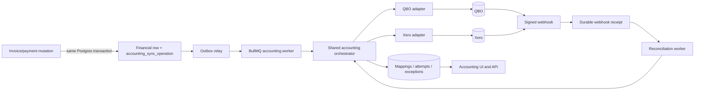

# PSA P0-1 Accounting Sync — QuickBooks Online and Xero Design

**Date:** 2026-07-16

**Status:** Approved design; written-spec review revisions applied 2026-07-16

**Source:** P0 #1 in `internal/psa-gap-matrix-2026-07.md`

**Predecessors:**

- `docs/superpowers/specs/2026-06-14-billing-architecture-overview.md`
- `docs/superpowers/specs/2026-06-23-quickbooks-accounting-integration-design.md`
- `docs/superpowers/specs/2026-06-29-quickbooks-customer-import-design.md`

This spec replaces the June program outline for all unbuilt accounting phases. The
shipped connection foundation and QuickBooks customer import remain the starting
point. Where the June design conflicts with shipped code or this document, this
document is authoritative.

## 1. Executive summary

Breeze will provide production-grade accounting synchronization for QuickBooks
Online (QBO) and Xero through one shared control plane and two provider adapters.
QBO reaches production readiness first; Xero follows against the same contracts.
P0-1 is complete only when both providers pass the same behavioral acceptance suite.

Breeze remains authoritative for customers, catalog items, invoices, and invoice
corrections. Payments may originate in Breeze or the active accounting provider:

- Breeze customers, catalog items, issued invoices, voids, and Breeze-recorded
  payments flow outbound.
- QBO/Xero payment activity and paid state flow inbound.
- Provider-originated edits to customers, items, or invoices never overwrite Breeze.
- Stable origin and remote IDs suppress echo loops in both directions.

Each partner may retain historical QBO and Xero connection instances, but exactly
one connected instance can be active for new posting. Switching providers never
deletes mappings, sync attempts, exceptions, or audit history.

The money path is durable. Financial mutations write accounting operations to a
transactional outbox in the same database transaction. BullMQ is delivery machinery,
not the source of truth. A Redis outage, worker crash, repeated webhook, or retry must
not lose work or create a duplicate invoice or payment.

## 2. Problem and desired outcome

### 2.1 Problem

Breeze already owns the operational billing lifecycle, but the accounting bridge is
incomplete:

- QBO OAuth, encrypted tokens, token rotation, connection settings, and health exist.
- QBO customers can be browsed and imported as Breeze organizations and default sites.
- QBO item listing/upsert, customer upsert, invoice push/void, and reconciliation are
  still `NotImplemented` methods.
- There is no durable accounting worker, outbox, generic entity mapping, sync log,
  manual/bulk posting flow, inbound payment idempotency, or exception center.
- Xero exists only in the provider type vocabulary; it has no adapter, routes, or UI.
- The public accounting documentation currently describes invoice/payment sync that
  has not shipped.

The practical result is that an MSP still re-keys invoices and payments or operates
with books that lag Breeze.

### 2.2 Outcome

After P0-1, a partner can:

1. Connect QBO or Xero and select one active posting provider.
2. Verify the remote company, base currency, chart-of-accounts defaults, and tax setup.
3. Review or create one-to-one customer and item mappings.
4. Automatically or manually post issued invoices, including bulk posting.
5. Propagate invoice voids and Breeze-originated payments.
6. Reconcile provider-originated payments and payment reversals back into Breeze.
7. See the status and history of every operation, resolve exceptions, and retry safely.
8. Disconnect or switch providers without erasing financial provenance.

No part of this outcome requires editing core invoice or catalog rows with provider
IDs. External identity remains connection-scoped.

## 3. Current repository baseline

The implementation plan must build on these shipped seams rather than recreate them.

| Capability | Current implementation | Required treatment |
|---|---|---|
| Connection schema | `apps/api/src/db/schema/accounting.ts` | Extend for connection instances, active-provider selection, payment defaults, and company identity. |
| Encrypted connection CRUD | `services/accounting/accountingConnectionService.ts` | Preserve encryption; change disconnect from deletion to retained history. |
| Token lifecycle | `services/accounting/accountingTokens.ts` | Generalize provider errors and add a per-connection refresh lock. |
| Provider interface | `services/accounting/types.ts` | Replace `unknown[]` write methods with typed DTOs and Xero-compatible authorization/tenant selection. |
| QBO adapter | `services/accounting/quickbooksProvider.ts` | Keep OAuth/customer listing/webhook verification; implement the remaining operations. |
| Provider registry | `services/accounting/providerRegistry.ts` | Register Xero only after its contract suite passes. |
| Accounting routes | `routes/accounting/index.ts` | Split by resource as the surface grows; retain compatible QBO connection URLs. |
| QBO customer import | `services/accounting/quickbooksCustomerImport.ts` | Preserve create-org/default-site behavior; route identity through generic mappings. |
| QBO UI | `apps/web/src/components/integrations/QuickbooksIntegration.tsx` | Evolve into shared accounting connection/setup views. |
| Invoice lifecycle | `services/invoiceService.ts` | Write transactional accounting operations during issue, void, payment record, and payment void. |
| Reserved invoice event bus | `services/invoiceEvents.ts` | Do not use as the money-flow delivery guarantee; it swallows enqueue failures. |
| Payments | `db/schema/invoices.ts::invoicePayments` | Add origin and soft-void lifecycle so posted/reconciled allocations retain identity and audit history; keep provider IDs in mapping tables. |

The existing `organizations.accounting_provider` and
`organizations.accounting_external_id` columns are a shipped exception to the billing
architecture rule. Section 8 defines their compatibility migration.

## 4. Locked product decisions

These decisions came from the design review and are not implementation options:

1. **Directional authority, not editable merging.** Breeze owns customer, item, and
   invoice content. Accounting providers own provider-entered payment settlement.
2. **Payments flow both ways.** Manual and Stripe payments recorded in Breeze post to
   the active provider. Provider-entered payments reconcile into Breeze.
3. **One active provider.** A partner cannot post the same Breeze transaction to QBO
   and Xero simultaneously.
4. **Both providers are in P0-1.** QBO ships first, but Xero parity is part of the
   completion definition.
5. **Shared control plane.** Connections, mappings, outbox, retries, permissions, sync
   history, exceptions, and UI are provider-neutral.
6. **Durable asynchronous delivery.** Remote calls never occur inside the financial
   database transaction or while a request-scoped DB transaction is held open.
7. **Issued invoices are immutable.** Corrections use void and reissue. Remote edits do
   not flow back.
8. **Mapping is explicit.** Suggested matches require confirmation before linking an
   existing remote object. A user can instead approve creation.
9. **History survives disconnect.** Disconnect revokes/clears usable credentials and
   stops new work; it does not delete connection identity, mappings, or sync evidence.
10. **Tax mismatch fails visibly.** A remote tax difference greater than one minor
    unit of the connection currency (for example $0.01 for USD) creates a variance
    exception and pauses subsequent automatic posting for that connection.

## 5. Scope

### 5.1 In scope

- QBO and Xero OAuth connection, refresh, reconnect, disconnect, tenant/company
  selection, and one-active-provider enforcement.
- Company identity and base-currency verification.
- Remote customer, item, account, and tax-code discovery.
- Customer and catalog-item mapping, suggestion, confirmation, creation, remapping,
  and unlinking when no posted transaction depends on the mapping.
- Default income/item, payment/deposit, and tax mappings needed to create valid remote
  transactions.
- Customer and catalog-item outbound upsert.
- Issued invoice outbound create, manual/bulk post, retry, and remote void.
- Manual and Stripe payment outbound create/reverse where the provider permits it.
- Provider payment and invoice-state reconciliation inbound.
- Payment-origin metadata and a soft-void lifecycle for `invoice_payments` so outbound
  reversals and inbound reversals never depend on deleted rows.
- Partial, over-, and multi-invoice payment detection; safe allocations where the
  local model can represent them; exceptions otherwise.
- Webhook ingestion plus scheduled reconciliation backstops.
- Transactional outbox, replay-safe workers, per-operation attempts, dead-letter
  visibility, repair sweeps, and sanitized observability.
- Connection, mapping, invoice/payment sync, and exception UI.
- Explicit accounting permissions, MFA gates, audit events, RLS, cascade/retention
  behavior, and cross-tenant tests.
- Migration of shipped QBO organization links into the authoritative mapping model.
- Public documentation correction and progressive enablement for QBO and Xero.

### 5.2 Out of scope

- Provider edits overwriting Breeze customers, catalog items, or invoices.
- Posting to QBO and Xero simultaneously.
- Importing arbitrary provider invoices into Breeze.
- Foreign-exchange conversion or consolidated multi-currency accounting.
- A new jurisdictional or compound-tax engine.
- Credit-note/CreditMemo creation before the Breeze credit-note feature exists.
- Automatic refund handling that requires a credit note; these cases become exceptions.
- Raw time-entry export independent of an invoice.
- QBO classes/locations or Xero tracking categories.
- Purchase orders, expenses, bills, payroll, or general-ledger journal sync.
- A third accounting provider.

## 6. Authority and conflict model

| Entity | Authoritative system | Outbound behavior | Inbound behavior |
|---|---|---|---|
| Customer | Breeze | Create/update the confirmed mapped remote customer. | Discover/match only; never overwrite a Breeze org. Remote inactive/deleted state becomes an exception. |
| Catalog item | Breeze | Create/update the confirmed mapped remote item. | Discover/match only; never overwrite catalog data. |
| Invoice | Breeze | Create after issue; void after Breeze void. | Read remote identity, balance, tax, links, and state for verification only. Remote content edits become conflicts. |
| Breeze payment | Breeze | Create/apply to the mapped remote invoice; reverse if locally voided and provider rules allow. | Echo events update the mapping and succeed as no-ops. |
| Provider payment | Active QBO/Xero connection | Never echo back to the same provider. | Create/update/reverse local allocations idempotently while the connection is active. |
| Tax/account mapping | User-confirmed configuration | Use the selected references. | Refresh availability and detect inactive/deleted references; do not auto-remap. |

Conflict rules:

- A confirmed mapping is one-to-one inside a connection. One remote customer cannot map
  to two Breeze organizations, and one organization cannot map to two remote customers
  in the same connection. The same organization may have one mapping in a historical
  QBO connection and one in a Xero connection.
- A remote customer/item update never changes the local entity. If an identifying
  field diverges, the mapping UI shows the divergence and lets the user push Breeze or
  deliberately remap.
- A remote invoice that differs from the immutable Breeze snapshot is marked
  `remote_conflict`; Breeze does not overwrite it automatically after the initial
  successful create.
- A provider payment already mapped to a Breeze payment allocation is a replay, not a
  new payment.
- A provider payment that touches an unknown invoice, unsupported credit object,
  unsupported currency, or amount that cannot be represented safely becomes an
  exception and does not partially mutate local balances.
- New payment activity from an inactive/historical provider never changes Breeze
  balances. Activity timestamped before deactivation may finish reconciling; later
  activity becomes an `inactive_provider_activity` exception.

## 7. Architecture



### 7.1 Components

#### Accounting connection service

Owns encrypted credentials, remote tenant identity, status, active-provider state,
configuration, refresh locking, reconnect, and soft disconnect. It never logs or
returns decrypted tokens outside the provider call boundary.

#### Accounting provider adapter

Owns provider URLs, OAuth/token details, remote DTO translation, concurrency tokens,
idempotency headers/parameters, webhooks, query pagination, tax/account quirks, and
provider error parsing. It does not decide Breeze permissions, retries, or mapping
policy.

#### Accounting orchestrator

Owns dependency resolution and state transitions. Given a durable operation, it loads
the immutable local snapshot, validates connection/mappings, calls the active adapter,
persists mappings and normalized results, and creates an exception when human action is
required.

#### Outbox relay and workers

The relay claims committed `pending` operations using short DB transactions and adds a
deterministically keyed BullMQ job. Deterministic job keys use `-` separators only;
BullMQ job IDs must never contain colons (repository rule). A repair sweep requeues DB operations left in
`pending`, stale `queued`, or stale `running` states. Workers may run more than once;
database uniqueness plus provider idempotency makes repeats safe.

State transitions are fenced compare-and-set updates:

1. The relay moves eligible `pending -> queued` only when `next_attempt_at <= now()`.
2. A worker moves `queued -> running`, writing a random `lease_token`, worker identity,
   and bounded `lease_expires_at`.
3. Heartbeats extend only the matching lease token.
4. Attempt/result/mapping persistence and the terminal operation update occur in one
   short transaction whose operation update includes
   `WHERE status='running' AND lease_token=:token`.
5. A repaired worker receives a new token. A stale worker may finish a remote call, but
   its fenced completion update affects zero rows and cannot overwrite the new owner's
   result. The new owner adopts the idempotent/read-after-write result.

Repair clears expired lease ownership and preserves the logical idempotency key and
immutable payload. It resets to `pending` only when persisted attempt evidence proves
no provider mutation started; otherwise it moves the operation to `ambiguous` for
read-after-write recovery. Queue-add failure leaves/reverts the DB row recoverable;
Redis state is never the only record of work.

#### Webhook receiver and reconciler

Webhook endpoints verify the raw body using app-level provider secrets before parsing.
They durably record a deduplicated receipt and acknowledge quickly; all provider reads
and local financial changes happen asynchronously. Scheduled reconciliation uses
per-stream cursors with an overlap window to recover missed and out-of-order events.

#### Accounting read model/API

API queries join connections, mappings, operations, attempts, and exceptions into
connection health, mapping workspaces, invoice badges, and Sync Center views. Provider
payloads and secrets are not returned.

### 7.2 Typed provider contract

The existing `AccountingProvider` interface must stop accepting `unknown[]`. The shared
contract is conceptually:

```ts
type AccountingProviderId = 'quickbooks' | 'xero';

type ProviderErrorCategory =
  | 'reauth_required'
  | 'rate_limited'
  | 'transient'
  | 'ambiguous_write'
  | 'validation'
  | 'not_found'
  | 'conflict'
  | 'configuration';

interface AccountingProvider {
  readonly provider: AccountingProviderId;
  readonly capabilities: ProviderCapabilities;

  buildAuthorizationUrl(input: AuthorizationStart): string;
  completeAuthorization(input: AuthorizationCallback): Promise<AuthorizationResult>;
  refresh(input: RefreshInput): Promise<ConnectionTokens>;
  getCompanyProfile(ctx: ProviderContext): Promise<RemoteCompanyProfile>;

  listCustomers(ctx: ProviderContext, page: RemotePageRequest): Promise<RemotePage<RemoteCustomer>>;
  listItems(ctx: ProviderContext, page: RemotePageRequest): Promise<RemotePage<RemoteItem>>;
  listAccounts(ctx: ProviderContext): Promise<RemoteAccount[]>;
  listTaxCodes(ctx: ProviderContext): Promise<RemoteTaxCode[]>;

  upsertCustomer(ctx: ProviderContext, input: CustomerUpsert): Promise<RemoteWriteResult>;
  upsertItem(ctx: ProviderContext, input: ItemUpsert): Promise<RemoteWriteResult>;
  createInvoice(ctx: ProviderContext, input: InvoiceCreate): Promise<RemoteInvoiceResult>;
  voidInvoice(ctx: ProviderContext, input: InvoiceVoid): Promise<RemoteWriteResult>;
  createPayment(ctx: ProviderContext, input: PaymentCreate): Promise<RemotePaymentResult>;
  reversePayment(ctx: ProviderContext, input: PaymentReverse): Promise<RemoteWriteResult>;

  reconcile(ctx: ProviderContext, input: ReconcileRequest): Promise<ReconcilePage>;
  normalizeError(error: unknown): NormalizedProviderError;
}
```

`ProviderCapabilities` declares native behavior such as explicit tax override, native
idempotency-window length, webhook event categories, and multi-allocation representation.
It cannot waive P0 outcomes. Both GA adapters must implement customer/item upsert,
invoice create/void, payment create, payment reversal for provider-reversible states,
multi-invoice payment reads, and incremental reconciliation. A remote transaction state
that cannot legally be reversed is a normalized conflict exception; an adapter that
cannot attempt reversal at all fails the P0 parity gate.

The shared contract suite is outcome-identical but capability-parameterized. For
example, one adapter may use an explicit tax override while another uses line tax types;
both must return normalized totals and produce the same Breeze variance behavior.

Webhook verification is a provider module function using app-level environment secrets,
not a method that requires a decrypted partner connection. After signature validation,
the parsed remote tenant/realm identifies the connection instance.

Every write input includes a stable Breeze logical operation ID, the current persisted
provider-attempt request ID, currency, and a fully materialized snapshot. The logical
ID never changes during retries; provider request-ID reuse follows the provider's
documented lifetime rules. Every write result includes remote ID, remote version or
sync token when available, remote document number/reference, remote totals, and a
sanitized response summary.

## 8. Data model

All new accounting tables are partner-axis tenant tables. Their migrations enable and
force RLS and create all CRUD policies in the same file. They are added to
`PARTNER_TENANT_TABLES` and receive functional cross-partner forge tests under
`breeze_app`.

### 8.1 `accounting_connections` evolution

Keep the existing table and encrypted token columns. Add:

| Column | Purpose |
|---|---|
| `remote_tenant_key_hash` | Versioned keyed hash of QBO realm ID/Xero tenant ID for equality and reconnect detection without exposing the raw identifier. |
| `remote_tenant_key_version` | Identifies the server-side HMAC key version used for safe key rotation/backfill. |
| `remote_company_name` | User-visible company/organization name. |
| `is_active` | Whether this connection receives new outbound work. |
| `activated_at`, `deactivated_at` | Activation history. |
| `disconnected_at`, `archived_at` | Retained lifecycle instead of hard deletion. |
| `default_payment_account_ref` | QBO deposit/undeposited-funds or Xero payment-enabled account. |
| `auto_post_paused_at`, `auto_post_pause_reason` | Connection-level safety pause, including tax variance. |
| `last_webhook_at`, `last_reconcile_at` | Health display and monitoring. |

Reuse `home_currency`, `default_income_account_ref`, `default_tax_code_ref`,
`push_mode`, `status`, `last_sync_at`, and `last_error`.

Expand connection `status` to the explicit lifecycle: `pending_setup`, `connected`,
`disconnecting`, `disconnected`, `reauth_required`, `legacy_unverified`, and `error`.
Add CHECK constraints so `is_active=true` requires `status='connected'` and usable
encrypted credentials; disconnected/legacy stubs cannot be activated by updating one
column.

Replace the current `(partner_id, provider)` uniqueness rule with connection-instance
identity:

- Unique `(partner_id, provider, remote_tenant_key_hash)` when the hash is present.
- Partial unique `(partner_id, provider) WHERE remote_tenant_key_hash IS NULL AND
  archived_at IS NULL` so retries cannot create duplicate pending/legacy stubs.
- Partial unique `(partner_id) WHERE is_active = true`.
- Existing rows get their tenant hash during an application backfill that can decrypt
  `realm_id_encrypted`; no migration logs the realm ID.

OAuth for a different realm/tenant creates a pending connection instance rather than
overwriting the old row. Reconnecting the same tenant updates the matching instance.

The existing per-connection `webhook_verifier_token_encrypted` column becomes legacy.
QBO and Xero webhook signing secrets are app/environment scoped, so new code reads them
from server secrets and never writes them to partner rows.

### 8.2 `invoice_payments` evolution

Bidirectional payment sync requires a durable local payment identity. Change
`invoice_payments` from hard-delete-on-void to an append-preserving lifecycle:

| Column | Purpose |
|---|---|
| `origin` | `manual`, `stripe`, or `accounting_provider`; controls outbound echo suppression without storing a provider ID. |
| `voided_at` | Excludes the allocation from paid/balance totals while retaining the row. |
| `voided_by` | User who voided it; null for provider/system reversals. |
| `void_reason` | Required bounded reason for user actions or normalized provider reversal reason. |

Add a unique `(id, invoice_id)` target for payment-allocation FKs and a unique
`invoices(id, partner_id)` target for accounting partner binding. The
`(id, partner_id)` binding is only meaningful if `invoices.partner_id` is
`NOT NULL`: under Postgres `MATCH SIMPLE`, a composite FK with any NULL column
silently enforces nothing. Verify or backfill `invoices.partner_id` and add the
`NOT NULL` constraint in the same expand migration, before any accounting FK
targets it. An accounting
allocation references both `(invoice_payment_id, invoice_id)` and
`(invoice_id, partner_id)`, so matching a payment ID cannot smuggle an invoice from
another partner. Update all invoice payment sums/lists so only `voided_at IS NULL`
allocations contribute to `amount_paid`, `balance`, and payment displays; history views
may explicitly include voided rows.

Existing rows backfill `origin='manual'`, then an application backfill marks rows linked
from `invoice_stripe_payments.invoice_payment_id` as `stripe`. The migration reports
both counts. No provider identity is added to `invoice_payments`;
`accounting_remote_payments` and `accounting_payment_allocations` remain authoritative.

`voidPayment` becomes an update plus recomputation, not a delete. This is an intentional
core-schema exception to the older “no billing-core changes” assumption because P0-1
expanded the approved scope to include outbound payments and reversals. It preserves
rather than weakens the immutable financial audit trail.

### 8.3 `accounting_entity_mappings`

Connection-scoped mappings for customer, item, and invoice identity:

```text
id, connection_id, partner_id,
entity_type ('customer' | 'item' | 'invoice'),
organization_id?, catalog_item_id?, invoice_id?,
remote_entity_type, remote_id, remote_version, remote_document_number,
remote_display_name, link_state ('legacy_unverified' | 'suggested' | 'confirmed' |
                                 'create_approved' | 'inactive'),
created_by, confirmed_by, confirmed_at, last_verified_at, created_at, updated_at
```

The table uses typed nullable local FK columns rather than one unconstrained
polymorphic UUID. A CHECK constraint requires exactly the local reference appropriate
to `entity_type`. Composite partner-safe FKs prevent a mapping from pointing at a
connection or local entity owned by another partner.

For invoice mappings, the CHECK requires both `invoice_id` and its owning
`organization_id`; the FKs bind `(invoice_id, partner_id)` to the invoice and
`(organization_id, partner_id)` to the organization. Customer mappings require only
the owning organization reference, and item mappings bind the catalog item directly to
the partner. These physical bindings apply even when the worker runs in system context.

Partial unique indexes enforce one local mapping per connection/entity type. Customer,
item, and invoice mappings uniquely claim
`(connection_id, remote_entity_type, remote_id)`.

Mapping rows contain identity and concurrency metadata only. Operational success,
failure, and retries live in sync operations/attempts.

### 8.4 `accounting_remote_payments` and `accounting_payment_allocations`

Payment identity is not stored in the generic entity mapping because one remote payment
can allocate across several invoices.

`accounting_remote_payments` is the provider payment header:

```text
id, connection_id, partner_id,
remote_payment_id, remote_version, remote_status,
origin ('breeze' | 'provider'),
payment_date, currency, total_amount,
outbound_operation_id?, first_seen_at, last_verified_at, reversed_at,
created_at, updated_at
```

Unique `(connection_id, remote_payment_id)` claims the remote payment once. For an
outbound payment, the header is created when the provider returns identity. For an
inbound payment, it is created with all allocations in the same transaction.

`accounting_payment_allocations` links that header to one or more local allocations:

```text
id, remote_payment_header_id, connection_id, partner_id,
invoice_payment_id, invoice_id,
remote_invoice_id, remote_allocation_key,
amount, is_active, reversed_at, created_at, updated_at
```

Unique `(remote_payment_header_id, remote_allocation_key)` prevents a remote allocation
from being applied twice. Unique `(connection_id, invoice_payment_id)` prevents a
Breeze allocation from being posted twice. The allocation key uses the provider line
identity when present, otherwise a deterministic key from remote invoice ID and
normalized allocation facts.

The allocation's `(remote_payment_header_id, connection_id, partner_id)` composite FK
binds it to the exact header and tenant. Its `(invoice_payment_id, invoice_id)` FK binds
the allocation to the payment row, and `(invoice_id, partner_id)` binds that invoice to
the tenant. Reversing/deleting one provider payment
soft-voids every linked active local allocation in one deterministic-lock-order
transaction and retains the header and child rows as history.

### 8.5 `accounting_tax_mappings`

```text
id, connection_id, partner_id,
breeze_tax_key, breeze_rate,
remote_tax_ref, remote_tax_name,
is_default, is_active, last_verified_at, created_at, updated_at
```

`breeze_tax_key` is deterministic from the invoice tax model, such as
`taxable:0.08250` or `exempt`. A connection may have one default taxable mapping and
one explicit mapping per Breeze rate. Provider-specific tax metadata remains in a
bounded sanitized JSON column only when no shared scalar can represent it.

### 8.6 `accounting_sync_operations`

This is both the transactional outbox and the current operation read model:

```text
id, connection_id, partner_id,
direction ('outbound' | 'inbound'),
entity_type ('customer' | 'item' | 'invoice' | 'payment' | 'reconcile'),
organization_id?, catalog_item_id?, invoice_id?, invoice_payment_id?, operation,
local_version, idempotency_key,
status ('pending' | 'queued' | 'running' | 'succeeded' |
        'succeeded_with_variance' | 'waiting_dependency' | 'ambiguous' |
        'blocked' | 'failed' | 'canceled'),
payload, payload_sha256,
depends_on_operation_id?, available_at, next_attempt_at,
queued_at, started_at, completed_at,
lease_owner?, lease_token?, lease_expires_at?,
attempt_count, last_error_category, last_error_code, last_error_message,
created_by, created_at, updated_at
```

`payload` is an immutable, versioned, sanitized financial snapshot sufficient to finish
the operation after the source record changes or is removed. It may contain invoice
line amounts and payment allocation facts; it must never contain OAuth tokens, webhook
secrets, raw card data, or unrestricted provider responses.

The unique idempotency key is derived from connection instance, entity, operation, and
local version. A new business action gets a new version; a technical retry reuses the
same key and identical payload.

Typed nullable entity columns plus a CHECK constraint bind each entity operation to the
appropriate partner-safe composite FK. `reconcile` is the only operation type with no
local entity FK. A generic unconstrained `entity_id` is not permitted.

Add unique `(id, connection_id, partner_id)` for composite child FKs.
`depends_on_operation_id` uses a composite self-FK with the same connection/partner.
Invoice operations bind `(invoice_id, partner_id)`; payment operations additionally
bind `(invoice_payment_id, invoice_id)`. Customer and item operations use their
corresponding partner-safe composite targets.
Worker claims and terminal writes compare-and-set `lease_token`; an expired worker
cannot overwrite the result of a repaired/reclaimed operation.

### 8.7 `accounting_sync_attempts`

Append-only attempt evidence:

```text
id, operation_id, connection_id, partner_id,
attempt_number, provider_request_id,
started_at, send_started_at, response_received_at, completed_at,
outcome, provider_http_status,
error_category, error_code, error_message,
remote_id, remote_version, response_summary,
created_at
```

Errors and summaries are length-bounded and sanitized. Attempt rows are never updated
into a different outcome.

The worker persists `send_started_at` before entering the provider mutation call and
`response_received_at` after receiving a complete response. A crash or timeout with
`send_started_at` present and no conclusive response is conservatively ambiguous; this
may classify a pre-socket crash as ambiguous, but it prevents duplicate financial
creates.

The attempt uses composite
`(operation_id, connection_id, partner_id) -> accounting_sync_operations` rather than an
unbound `operation_id` FK.

### 8.8 `accounting_webhook_receipts`

```text
id, connection_id, partner_id, provider,
provider_event_key, body_sha256,
event_time, received_at, processing_status, processed_at, last_error
```

The raw body is used in memory for signature verification and then discarded. The
provider event key uses the native event/sequence identifier when available and a
deterministic tenant/entity/time/hash composite otherwise. Uniqueness prevents repeated
delivery from creating repeated reconciliation work.

### 8.9 `accounting_sync_cursors`

```text
connection_id, partner_id, stream,
cursor, overlap_from, last_success_at, updated_at
```

One row per provider stream (for example `payments` and `invoices`) replaces the single
connection-wide `cdc_cursor` assumption. `cursor` is bounded JSON because QBO and Xero
use different cursor shapes. Cursor advancement occurs only after every discovered
change is durably applied or represented by a persisted exception.

### 8.10 `accounting_sync_exceptions`

```text
id, connection_id, partner_id, operation_id?, webhook_receipt_id?,
category, entity_type,
organization_id?, catalog_item_id?, invoice_id?, invoice_payment_id?, remote_entity_id?,
summary, details, status ('open' | 'resolved' | 'dismissed'),
resolution, resolved_by, resolved_at, created_at, updated_at
```

Exception details are sanitized and structured enough for deterministic resolution.
Dismissal records an audit event and never marks an underlying sync as successful.
Typed local references use the same partner-safe composite FKs as operations and
mappings so a system-context join cannot expose another partner's entity. Optional
operation/receipt parents use composite `(parent_id, connection_id, partner_id)` FKs.

### 8.11 Legacy QBO organization-link migration

Backfill each organization with `accounting_provider='quickbooks'` and a non-null
`accounting_external_id` into a QBO customer mapping.

- Conflicts are not silently selected. The migration/backfill records counts and creates
  open mapping exceptions.
- Because the legacy columns do not record the originating QBO realm, new mappings begin
  as `legacy_unverified`. A remote lookup against the selected current tenant plus
  identity comparison promotes them to `confirmed`; a numeric ID match alone is not
  enough across realms.
- If no QBO connection survives, create a retained credential-free
  `status='legacy_unverified'` connection stub for that partner and bind the mappings to
  it. A later OAuth flow may adopt the stub only after tenant selection and remote
  identity verification. Corrupt/undecryptable tenant identity marks the connection
  error and never guesses.
- Cleanup SQL follows the repository rule to log affected row counts with
  `GET DIAGNOSTICS` and `RAISE WARNING`.
- Existing organization columns and their partial unique index remain during P0-1 for
  rolling compatibility.
- Reads prefer the mapping table. A temporary compatibility read is allowed only until
  all environments report zero unmigrated links.
- Dropping the legacy columns is a separate fix-forward migration after at least one
  release and is not part of P0-1.

### 8.12 Rolling-safe migration sequence

Do not drop an index or stop a legacy write in the same deployment that first introduces
its replacement. Production may run overlapping old/new API instances.

1. **Expand:** add nullable connection-instance columns, new tables, indexes, composite
   FK targets, payment soft-void/origin columns, and RLS. Keep the existing
   `accounting_connections_partner_provider_idx` because shipped
   `upsertConnection` uses it as its `ON CONFLICT` target.
2. **Compatibility release:** dual-write QBO customer imports to the legacy org columns
   and new mapping table in one transaction. New readers fall back to legacy. Keep
   multi-instance connection creation and outbound payment sync feature-disabled.
3. **Backfill/verify:** create legacy stubs where needed; backfill mappings, tenant-key
   hashes, and `invoice_payments.origin`; mark Stripe-linked rows from
   `invoice_stripe_payments`. Record every count and conflict. Re-run until idempotently
   clean, then assert zero unmigrated eligible rows.
4. **Code cutover:** deploy connection writes keyed by connection ID/tenant hash instead
   of `(partner_id, provider)` conflict upsert. Continue dual-writing org legacy columns
   while any old instance can run. Tenant switching remains disabled.
5. **Contract:** only after fleet/version verification, apply a later migration that
   drops the old partner/provider unique index and enables the connection-instance and
   one-active-provider indexes. Then enable multi-instance setup/switching.
6. **Legacy-write cutover:** after another fleet verification, stop writing org legacy
   columns. Retain columns/read fallback through P0-1; removal is a later release.

Outbound payment sync cannot be enabled until the payment-origin backfill reports zero
unknown rows. Mapping-based reads cannot be made exclusive until legacy-link verification
reports zero unmigrated eligible rows. Every migration is hand-written, idempotent,
ordered explicitly for same-day dependencies, and fixes forward rather than editing a
shipped file.

### 8.13 Retention and deletion behavior

Accounting records are financial provenance, not disposable cache data:

- Disconnect, provider switch, mapping unlink, payment reversal, and exception
  dismissal are soft lifecycle changes. They do not hard-delete connections, mappings,
  remote-payment headers/allocations, operations, attempts, receipts, cursors, or
  exceptions.
- P0-1 applies no time-based pruning to those tables or to immutable operation
  snapshots. They remain for the life of the partner unless a later approved retention
  policy replaces this rule.
- `DELETE /mappings/:mappingId` means audited unlink: set the mapping inactive and keep
  its identity/version history. A remote identity with historical financial operations
  cannot be reassigned through deletion; remapping requires an explicit conflict
  resolution that preserves both records.
- Organizations and catalog items referenced by accounting history use the existing
  archive/soft-delete lifecycle. Issued invoices remain immutable and payments are
  soft-voided as specified above. Direct hard deletion of a referenced local financial
  entity is restricted rather than cascading away accounting evidence, outside the
  tenant-erasure flows in Section 8.14.
- A connection may be hard-deleted only as part of complete partner deletion or an
  authorized tenant-erasure workflow. That workflow deletes accounting children in an
  explicit tested dependency order before core partner rows; ordinary connection APIs
  expose no hard delete.
- Partner deletion removes the tenant's accounting payloads and provider identifiers.
  Any separately retained platform audit record follows the repository's existing audit
  retention policy and contains only actor, action, sanitized IDs, and outcome—not
  operation payloads, customer financial details, or provider secrets.

Foreign-key actions encode these rules (`RESTRICT` for ordinary referenced financial
entities, explicit service-owned cleanup for organization and partner erasure per
Section 8.14) instead of relying on API discipline alone.

### 8.14 Organization erasure interaction

Partner erasure is not the only hard-delete flow. `cascadeDeleteOrg`
(`services/tenantCascade.ts`) hard-deletes a single customer organization today, and
`invoices` and `invoice_payments` are in its cascade set. The accounting tables are
partner-axis, so the org-axis `org_id` sweep never reaches them, while their
`RESTRICT`-style FKs into invoices and payments would abort the org cascade the first
time an org with accounting history is erased. Partner erasure runs the org cascade
for each child organization *before* its dynamic `partner_id` sweep, so the same
failure would break partner deletion too. This interaction is designed in, not left
to discovery:

- Org erasure deletes, inside the same cascade transaction and children-first:
  payment allocations referencing the org's invoices or payments; remote-payment
  headers whose every allocation belonged to the erased org; entity mappings whose
  local reference is the org or one of its invoices; and sync operations bound to the
  org's entities, together with their attempts and exceptions. Erasing the org erases
  the subject of that provenance; retaining sync history about deleted invoices would
  serve no audit purpose while breaking referential integrity. Partner-level rows
  with no org-entity reference (connections, cursors, webhook receipts, tax mappings,
  item-only operations) are untouched and survive as partner history.
- Because these tables intentionally use `organization_id` on a partner axis, neither
  the RLS shape-1 auto-discovery nor the org-cascade contract test (both key on a
  column literally named `org_id`) will force this registration mechanically.
  Implement the deletions as explicit pre-clear steps in the existing cascade
  machinery (the `ASSOCIATED_SYSTEM_SCOPED_TABLES`-style `clearSql` mechanism in
  `tenantCascade.ts`), and treat that registration as a mandatory same-PR checklist
  item for every accounting table that references an org-owned entity. This is the
  exact latent-erasure-bug class the repository has shipped five times; no automated
  contract covers these tables, so the checklist and the integration test below are
  the only guards.
- Org erasure follows the same fail-closed rule as disconnect: it returns 409 while
  an unexpired running lease or unresolved `ambiguous` operation references the org's
  entities, because a remote write may exist that has not been adopted or proven
  absent. Other nonterminal operations are canceled implicitly by the erasure; the
  erasure's own audit record is the cancellation evidence.
- One integration test proves that deleting an organization with confirmed mappings,
  posted invoices, reconciled provider payments, open operations, and open exceptions
  completes without FK violation and leaves no accounting row referencing the erased
  org's entities, while partner-level connection history survives.

This does not weaken Section 8.13: ordinary APIs still expose no hard delete, and
provider identity, connection lifecycle history, and non-erased-org evidence remain
intact.

## 9. Connection lifecycle

### 9.1 Connect and setup

1. A partner/system user with `accounting:manage` and current MFA starts OAuth.
2. The API signs state containing partner, user, provider, nonce, and expiry and binds
   it to the same-browser HttpOnly cookie. Preserve the current QBO protections.
3. The callback verifies state/cookie before token exchange or any tenant-scoped write.
4. The adapter exchanges the code and discovers remote tenant choices. QBO normally
   supplies one realm; Xero may return multiple authorized tenants.
5. The user selects exactly one tenant for the pending connection instance.
6. Breeze stores encrypted rotating tokens, the encrypted raw tenant ID, its keyed
   identity hash, company name, and base currency.
7. Setup loads accounts/tax codes and requires valid income, payment, and tax defaults.
8. A validation preview reports currency, inactive references, mapping counts, and
   blockers. It performs no financial writes.
9. Activation is a separate audited/MFA-gated action.

Home currency must equal the partner's Breeze currency. A mismatch blocks activation;
P0-1 never guesses an exchange rate.

### 9.2 Activation and switching

Activation runs in one transaction and succeeds only when:

- The candidate connection is connected and tokens are refreshable.
- Required account/tax references are active.
- Currency matches.
- No old active connection has `pending`, `queued`, `running`, `waiting_dependency`,
  `ambiguous`, `blocked`, or `failed` outbound operations, and it has no unresolved
  financial-variance exception.
- The actor confirms the provider/company switch.

Worker claim, activation, and disconnect use the same short-lived per-connection
coordination lock. No lock is held during provider HTTP. The lock only prevents a new
worker claim from racing the lifecycle transition.

The transaction deactivates the old instance and activates the new one. Historical
operations remain bound to their original connection. Failed/blocked old-provider work
does not move automatically; users must either resolve/retry it before switching or
cancel a conclusively non-ambiguous operation with an audited reason. An `ambiguous`
operation cannot be canceled or bypassed by switching.

### 9.3 Reconnect and tenant changes

Reauthorization for the same remote tenant updates credentials on the same connection
instance and preserves mappings. Authorizing a different tenant never overwrites the
old instance or reuses its mappings. It enters setup as a new instance.

### 9.4 Disconnect

Disconnect:

- Acquires the connection coordination lock and changes the connection to
  `disconnecting`, preventing new worker claims.
- Returns 409 with the safe operation IDs if any unexpired running lease or unresolved
  ambiguous write exists; credentials remain usable until that work is adopted,
  compensated, or fails visibly. An expired lease is repaired before disconnect can
  continue.
- Returns 409 with counts for other nonterminal/failed work unless the actor supplies a
  bounded cancellation reason and explicitly confirms the resulting remote divergence.
  Only conclusively non-ambiguous operations can be canceled; any existing exception
  remains open as historical evidence.
- Attempts provider revocation where supported.
- Clears or renders unusable encrypted access/refresh tokens.
- Sets `status='disconnected'`, timestamps the action, and deactivates the connection.
- Cancels the explicitly confirmed eligible operations and records the actor/reason.
- Retains the row, mappings, operations, attempts, exceptions, and audit events.

Because disconnect cannot pass a live/ambiguous operation, a remote post cannot finish
unrecorded after the API reports successful disconnection.

## 10. Mapping and setup workflow

### 10.1 Workspace

The mapping workspace has Customers, Items, Tax Codes, and Accounts tabs. Every tab
supports search, remote refresh, unmapped/suggested/confirmed/conflict filters, bulk
selection, and partial-result feedback.

### 10.2 Customer mappings

- Suggestions use normalized company name, billing email/domain, and address evidence.
- Exact remote ID from the legacy import begins `legacy_unverified` because the old
  columns lack realm provenance. It becomes confirmed only after the selected tenant
  returns that ID and identifying fields match or a user confirms it.
- A suggestion never becomes confirmed without user action.
- Actions: link existing remote customer, approve creation in the provider, create a
  Breeze org/default site from a remote customer, or leave unmapped.
- The existing QBO import cap of 500 selected customers remains. Each item is isolated
  so one failure does not roll back successful imports.
- Remapping is blocked once a posted invoice/payment depends on the mapping. The user
  must resolve dependent history instead of rewriting provenance.

### 10.3 Item mappings

- Suggestions prefer SKU/provider identifier, then normalized name; name-only matches
  remain suggestions.
- A catalog item can be linked to an existing active remote item or approved for remote
  creation.
- Manual/time/part/contract invoice lines without a catalog item use a configured
  fallback sales item and income account.
- A catalog-backed line must have a confirmed/create-approved item mapping unless the
  connection explicitly enables the same fallback item for unmapped catalog lines.
- Inactive remote items block affected invoice operations until remapped.

### 10.4 Normalized field mapping

The shared DTOs expose only fields that Breeze owns and both providers can represent
without changing their accounting meaning:

| Entity | Breeze snapshot sent outbound | Explicitly not sent |
|---|---|---|
| Customer | Organization name, billing contact name/email/phone, billing address, active state. | Internal settings, device/site data, contracts, notes, or provider balances. |
| Item | SKU/code, name, description, sales unit price, active state, service/non-inventory classification, income account, tax code. | Distributor credentials, internal cost/markup, inventory quantity, recurring commitment metadata, or purchase-side details. |
| Invoice | Invoice number, issue/due dates, currency, mapped customer, shaped sales lines, taxable state/tax, public notes/reference, and total. | Internal cost/margin, audit data, hidden ticket identifiers, or mutable upstream records. |
| Payment | Mapped invoice, amount, received date, safe reference, payment/deposit account, and origin marker. | Card/bank credentials, Stripe secrets, or unrestricted internal notes. |

QBO hardware/software items are created as non-inventory sales items unless a user links
an existing remote item; Breeze does not claim to synchronize inventory counts. Xero
item payloads likewise use sales details only. Recurring catalog metadata affects how
Breeze bills but is not misrepresented as a remote recurring product contract.

Provider adapters may omit an unsupported optional field. They may not silently map a
field to a different accounting concept.

### 10.5 Bundle shaping

The provider invoice must equal the immutable Breeze invoice total:

- Ordinary lines post their snapshot quantity, unit price, taxable state, and mapped or
  fallback item/account.
- For a bundle whose component revenue allocations exactly equal the headline amount,
  the accounting payload replaces the bundle parent with component allocation lines.
  Components inherit the parent's taxability so tax remains equal.
- If allocations are absent or do not equal the headline, post the bundle parent as one
  line using its mapped/fallback item. Component cost data stays in Breeze reporting and
  is not represented as fake revenue in the provider.
- Before any provider call, a pure shaping function proves that subtotal, taxable base,
  tax, and total equal the Breeze snapshot to the cent. Failure is a local validation
  blocker.

### 10.6 Tax and accounts

- Setup chooses the default income/sales account, payment/deposit account, exempt tax
  code, and default taxable code.
- Additional Breeze rates may map explicitly to provider tax codes.
- Inactive/deleted references block affected operations and create configuration
  exceptions; Breeze never silently chooses a replacement account.
- Provider adapters apply their native tax model but return normalized remote totals.
- A remote total or tax difference over one minor unit of the connection currency
  produces `succeeded_with_variance`, opens an exception, and pauses further auto
  posting on that connection. Already-created remote transactions are never hidden or
  called failed.
- Resolving the exception requires correcting mappings and void/reissue, or explicitly
  acknowledging a documented provider limitation. Acknowledgment does not rewrite the
  Breeze invoice total.

## 11. Outbound synchronization

### 11.1 Transactional intent

The organization, catalog, invoice, and payment services write an
`accounting_sync_operations` row in the same transaction for:

- `customer_upsert` after a mapped organization changes a synchronized billing field,
  or when remote creation is approved.
- `item_upsert` after a mapped catalog item changes a synchronized field, or when remote
  creation is approved.
- `invoice_post` when an invoice becomes issued and active `push_mode='auto'`. If auto
  posting is safety-paused, persist the operation as `blocked` with the pause reason so
  the invoice is visible rather than silently left behind.
- `invoice_void` when a voided invoice has a mapping or any post operation, even if the
  post is still queued/running/ambiguous.
- `payment_post` whenever a manual or Stripe payment is durably recorded for an active
  connection, even when its invoice mapping does not exist yet.
- `payment_reverse` whenever a Breeze payment with any post operation/header is
  soft-voided, even when the post is still running and has no remote identity yet.

Manual invoice mode writes no operation during issue. A later single/bulk Post action
creates the same `invoice_post` operation through the accounting service.

`push_mode` controls only initial invoice posting. Confirmed customer/item changes,
payment posting, invoice void compensation, and payment reversal always synchronize.
In manual mode, a payment recorded before its invoice is posted is persisted as
`waiting_dependency`; posting the invoice later releases it. This avoids a misleading
mode where invoices sync but their settlement silently does not.

When no provider is active and no historical mapping/operation binds the entity to a
connection, issue/payment mutations create no accounting operation and the invoice
remains `not_posted`; activating a provider does not retroactively post old invoices
without an explicit bulk action. A correction always targets the connection of the
original mapping/operation, never the newly active provider. Customer/item update
operations target only the active connection. Coalescing cancels an older unstarted
operation and inserts a new versioned row; no operation's immutable payload is ever
rewritten.

Because the current `issueInvoice` system transaction owns numbering, snapshotting, and
source-row flips, its outbox insert must occur inside that transaction. The existing
fire-and-forget `emitInvoiceEvent` may remain for non-financial consumers but is not the
accounting trigger.

### 11.2 Invoice dependency order

For each `invoice_post`:

1. Confirm the operation still targets the active connection instance it was created
   for; never retarget silently after a provider switch.
2. Load and validate the immutable payload hash and local invoice state.
3. Resolve or create the customer mapping if creation was approved.
4. Resolve or create required item mappings if creation was approved.
5. Validate accounts, tax mappings, currency, and shaped totals.
6. Create the remote invoice with the persisted provider-attempt request ID.
7. Persist remote ID/version/document number and the successful attempt atomically.
8. Read/normalize remote totals and create a variance exception when needed.
9. Re-read the current local invoice state. If it became void while create was in
   flight, release/create the dependent `invoice_void` compensation before completing.

A remote failure never rolls back the issued Breeze invoice. The operation remains
visible as blocked or failed.

Operations for the same connection/invoice are serialized. `invoice_void` waits for an
earlier `invoice_post` to resolve: it succeeds with `no_remote_action` if create is
conclusively absent, or runs immediately after a late/ambiguous create is adopted.

### 11.3 Provider idempotency

Use all three layers:

1. Database operation/mapping uniqueness.
2. Stable provider request identity on every technical retry.
3. Read-after-ambiguous-write recovery before issuing a new provider request identity.

QBO technical retries reuse the operation's stable `requestid` within provider limits.
Xero retries reuse the same `Idempotency-Key` only inside Xero's documented cache
window. After that window, the adapter must first query by the persisted Breeze
reference/document identity. If the remote record exists, it is adopted into the
mapping; if it provably does not exist, a new persisted attempt request ID may be used.
Database operation/mapping uniqueness remains authoritative in both cases.

Any timeout, connection loss, worker crash, or malformed response after a mutation may
have reached the provider is an **ambiguous write**, not an ordinary transient failure.
The worker atomically records the attempt outcome, moves the operation to `ambiguous`,
and opens one deduplicated exception. It must not issue another create with a new
provider request identity merely because the old idempotency window elapsed.

Recovery is fail-closed:

1. Retry with the same provider request identity only while the provider contract says
   that identity remains effective.
2. Query by known remote ID when present; otherwise query by the exact persisted Breeze
   document/reference identity after the adapter's consistency delay.
3. If a unique matching record is found, validate its tenant, type, currency, amount,
   and payload fingerprint before adopting it and releasing dependent compensation.
4. Treat absence as conclusive only when the adapter completed an authoritative lookup
   over the relevant provider scope after the consistency window. A rate limit, partial
   page, permission failure, unsupported exact lookup, or non-unique match is
   inconclusive.
5. Only conclusive absence permits a fresh persisted request identity and a return to
   `pending`. An inconclusive result stays `ambiguous`, blocks provider disconnect or
   switching, and requires further reconciliation or an audited exception-specific
   resolution. There is no generic “assume failed” action.

### 11.4 Document numbering

- Send the Breeze invoice number as QBO `DocNumber` and Xero `InvoiceNumber` where
  allowed.
- A remote number collision is a mapping/configuration conflict, not permission to
  create a second Breeze invoice.
- If a provider assigns a different number, store it on the invoice mapping and show
  both numbers. Never overwrite `invoices.invoice_number`.

### 11.5 Void and reissue

- Voiding an unsynced invoice cancels its not-yet-running post operation.
- Voiding an invoice whose post is running/ambiguous creates a dependent compensation
  operation; it never assumes the remote create failed merely because no mapping exists
  yet.
- Voiding a synced invoice creates one remote void operation using the latest remote
  version/concurrency token.
- The adapter reads the latest remote version before a destructive update.
- A remote invoice with linked/deposited transactions that cannot be voided creates a
  conflict exception. Breeze remains void locally and does not claim remote success.
- Reissued Breeze invoices are independent new mappings and remote documents, linked in
  Breeze through the existing replacement fields.

### 11.6 Payment posting

- Outbound payments require a successful invoice mapping and active payment account to
  execute, but the durable intent is created earlier and waits for those dependencies.
- The payment operation payload contains allocation amount, received date, local method,
  safe reference, local invoice ID, remote invoice ID, and origin `breeze`.
- The adapter maps the payment to the remote invoice rather than using a sales receipt.
- QBO multi-allocation payment structures and Xero batch-payment structures may be read
  inbound, but outbound Breeze payments remain one local allocation per operation.
- Provider response ID/version is stored in a remote-payment header plus allocation row
  before success.
- A later inbound event with that remote ID is an echo and updates verification state
  without inserting another local payment.

After any payment create success or ambiguous-write adoption, re-read the local payment.
If it was soft-voided while the remote call was in flight, release/create the dependent
`payment_reverse` immediately. Payment reversal is attempted only when provider rules
allow it. Deposited/reconciled or otherwise immutable remote payments create an
exception. The soft-voided local row, remote-payment header/allocation, and immutable
operation payload survive, so the worker never loses the identity or facts needed to
reverse and audit the payment.

### 11.7 Manual and bulk posting

- Manual mode exposes Post to accounting on eligible invoice details.
- The invoice list bulk bar accepts the repository-wide `BULK_ID_LIMIT`; the API creates
  one independent operation per invoice rather than one opaque provider batch.
- The response identifies every `queued`, `already_synced`, `already_queued`, `blocked`,
  `ineligible`, and `failed_to_queue` invoice.
- Bulk retry operates on failed/blocked operations after their blocker is resolved. It
  never creates a second business version merely to retry transport.
- The mapping workspace exposes Sync selected for confirmed customers/items. Local
  edits normally create automatic upsert operations; this action catches pre-feature or
  deliberately canceled rows and returns the same per-entity outcome contract.

## 12. Inbound reconciliation

### 12.1 Webhook processing

1. Read the raw request body with a strict size limit.
2. Verify the provider signature in constant time using the environment's app-level
   webhook secret.
3. Parse only after verification.
4. Resolve each realm/tenant to a retained connection instance in system DB context.
5. Insert a deduplicated webhook receipt and enqueue reconciliation.
6. Return within the provider acknowledgement deadline; no provider reads or financial
   mutation occurs inline.

A correctly signed event for an unknown tenant is acknowledged to avoid a retry storm,
but no partner row is fabricated. Emit a high-severity metric/Sentry event containing
only the versioned tenant-key HMAC and provider; do not retain the raw body or plaintext
tenant ID.

QBO expects a successful acknowledgement within three seconds; Xero expects a 2xx
within five seconds and a 401 for an invalid signature. Tests enforce tighter internal
budgets without using real network calls.

### 12.2 Scheduled backstop

- Run incremental reconciliation at least every 15 minutes for connected connection
  instances that are active, have nonterminal operations, or have operations completed
  within the prior 24 hours.
  For an inactive instance, process only known echoes or changes timestamped no later
  than `deactivated_at`; later provider-originated activity is persisted as an exception
  and does not alter local balances.
- Apply a five-minute overlap to tolerate clock skew and out-of-order delivery.
- Run a daily 24-hour overlap sweep for payments/invoices.
- QBO CDC only covers a bounded recent window; a cursor older than 29 days triggers a
  targeted recovery scan rather than an invalid CDC request.
- Xero uses its supported modified-since/paging mechanisms per stream.
- Cursor advancement is transactional with durable mappings, local allocations, or
  exceptions for every returned change.

### 12.3 Provider-originated payments

All payment mutation paths—manual, Stripe, accounting reconciliation, and reversal—use
the same transactional payment service. It locks the affected invoice row before
checking balance, inserting/soft-voiding allocations, recomputing status, writing the
accounting operation, and writing durable audit evidence. For a multi-invoice payment,
lock invoice IDs in sorted UUID order to prevent deadlocks, then revalidate every
outstanding balance inside the transaction. If any allocation is invalid or would
over-apply an invoice, roll back the entire group and create one exception outside the
failed transaction.

For each remote payment:

1. Resolve the connection and remote invoice mapping.
2. If the remote-payment header/allocation exists, treat it as a replay/update.
3. Validate currency and normalize decimal amounts to integer cents.
4. Lock every affected invoice in deterministic order and revalidate balances.
5. Insert one Breeze `invoice_payments` allocation per mapped invoice, with
   `method='other'`, `origin='accounting_provider'`, a safe provider reference, and
   `recorded_by=NULL`.
6. Insert the remote-payment header/allocation rows, recompute each invoice status, and
   write the accounting/audit evidence in the same transaction.
7. Emit the optional ordinary lifecycle event after commit; failure of that
   fire-and-forget bus cannot erase the durable accounting/audit evidence.

A remote payment spanning multiple invoices is split into local allocations only when
every invoice mapping, currency, and amount is valid. Otherwise the whole remote
payment becomes an exception; Breeze does not apply a misleading subset.

Overpayments, prepayments, credits, refunds, fees, and deleted/voided remote payments
are processed only where the existing local model can represent the result without
fabrication. Unsupported cases remain open exceptions until the relevant Breeze
financial primitive exists or a user records an audited manual resolution.

A remote reversal of a multi-invoice payment locks all linked invoices in the same
deterministic order, soft-voids every active allocation, recomputes every invoice, marks
the payment header reversed, and advances the cursor in one transaction. Partial group
reversal is forbidden.

### 12.4 Loop prevention

- Every outbound remote write persists its returned remote ID before success.
- Reconciliation checks remote ID mappings before inserting or emitting a new outbound
  operation.
- Inbound-created Breeze payment allocations carry origin metadata in their operation
  and remote-payment allocation row; the payment service suppresses `payment_post` for
  origin `accounting_provider`.
- Payload hashes detect a provider returning the same remote identity with conflicting
  allocation facts and create an exception.

## 13. State machines and retry behavior

### 13.1 Operation states

```text
pending <-> waiting_dependency
   |
   v
 queued -> running -> succeeded
             |------> succeeded_with_variance
             |------> ambiguous --adopt----------> succeeded
             |             |--prove absent-------> pending
             |------> blocked
             |------> failed
pending/queued/waiting_dependency -> canceled
blocked/failed --retry------------> pending
```

- `waiting_dependency` means a durable intent exists but a prerequisite operation or
  mapping has not completed. Dependency completion releases it without creating a new
  business operation.
- `blocked` means user/configuration action is required; it is not automatically retried.
- `failed` means technical retries were exhausted or a permanent provider failure has
  no safe automatic resolution.
- `ambiguous` means the provider may have committed a write whose identity Breeze has
  not safely adopted. It is never automatically converted to `failed`, canceled, or
  retried with a fresh request identity without the conclusive-absence procedure in
  Section 11.3.
- `succeeded_with_variance` is terminal for the remote write but always has an open or
  explicitly resolved variance exception.
- A running operation uses a lease. Repair moves an expired lease back to `pending`
  without changing its idempotency key only when its persisted attempt proves no
  provider mutation started. Otherwise repair moves it to `ambiguous` and begins
  read-after-write recovery.

### 13.2 Error categories

| Category | Behavior |
|---|---|
| `reauth_required` | Mark connection accordingly; block its work; show reconnect. |
| `rate_limited` | Honor provider retry hints; keep operation retryable. |
| `transient` | Retry network/timeout/5xx failures with bounded backoff. |
| `ambiguous_write` | Stop new creates; reconcile/adopt or prove absence using Section 11.3. |
| `validation` | Block with field-level remediation; no automatic retry. |
| `not_found` | Verify mapping/remote deletion and create an exception. |
| `conflict` | Fetch latest remote version, retry only if the conflict is mechanically safe; otherwise exception. |
| `configuration` | Pause affected work until account/tax/currency/mapping is corrected. |

The transient category applies only when the adapter proves the mutation was not sent,
or to non-mutating reads. Its schedule is 30 seconds, 2 minutes, 10 minutes, 1 hour, and
6 hours. After the fifth failed attempt, status becomes `failed`. A 429 uses
`Retry-After` or the provider reset time when present and does not retry earlier than
that value. Manual retry after failure reuses the same business operation and request
identity unless read-after-write proves no remote record exists and the provider
requires a fresh identity. Manual retry cannot bypass `ambiguous` safeguards.

## 14. API design

Keep existing QBO connection URLs working while introducing shared resources. Route
files split by resource under `apps/api/src/routes/accounting/`.

### 14.1 Connection/setup

```text
GET    /accounting/connections
GET    /accounting/:provider/connect
GET    /accounting/:provider/callback
POST   /accounting/connections/:id/select-tenant
PATCH  /accounting/connections/:id/settings
POST   /accounting/connections/:id/validate
POST   /accounting/connections/:id/activate
POST   /accounting/connections/:id/disconnect
```

### 14.2 Remote discovery and mappings

```text
GET    /accounting/connections/:id/remote/customers
GET    /accounting/connections/:id/remote/items
GET    /accounting/connections/:id/remote/accounts
GET    /accounting/connections/:id/remote/tax-codes
GET    /accounting/connections/:id/mappings
POST   /accounting/connections/:id/mappings/suggest
POST   /accounting/connections/:id/mappings/confirm
POST   /accounting/connections/:id/mappings/create-approved
DELETE /accounting/connections/:id/mappings/:mappingId
POST   /accounting/connections/:id/customers/import
POST   /accounting/connections/:id/customers/sync-bulk
POST   /accounting/connections/:id/items/sync-bulk
```

The two sync-bulk endpoints accept bounded typed local IDs and create one idempotent
operation per confirmed mapping. Mapping DELETE is the audited soft-unlink behavior in
Section 8.13, not physical deletion.

### 14.3 Posting, operations, and exceptions

```text
POST   /accounting/invoices/:invoiceId/post
POST   /accounting/invoices/post-bulk
GET    /accounting/operations
GET    /accounting/operations/:id
POST   /accounting/operations/:id/retry
POST   /accounting/operations/retry-bulk
GET    /accounting/exceptions
POST   /accounting/exceptions/:id/resolve
POST   /accounting/exceptions/:id/dismiss
```

### 14.4 Webhooks

```text
POST /webhooks/accounting/quickbooks
POST /webhooks/accounting/xero
```

Webhook routes are unauthenticated by Breeze identity, use raw-body signature
verification, have strict body/time limits, and are excluded from request DB context
until verification succeeds.

All POST/PATCH/DELETE web handlers use `runAction`. Batch endpoints return per-ID
results rather than hiding partial failures behind HTTP 200.

## 15. Authorization, tenancy, and security

### 15.1 Permissions

Add accounting actions to the existing resource/action RBAC model:

| Permission | Allows |
|---|---|
| `accounting:view` | Connections, mappings, operation status, and exceptions. |
| `accounting:manage` | Connect/reconnect/disconnect, activate, and change financial defaults. |
| `accounting:map` | Confirm/create/remap customer, item, tax, and account mappings. |
| `accounting:post` | Manual/bulk posting and retrying financial operations. |
| `accounting:resolve` | Resolve or dismiss reconciliation exceptions. |

All accounting access remains partner/system scoped; org-scoped users receive 403 and
cannot infer whether a connection or mapping exists. `accounting:manage` and
`accounting:map` mutations require MFA, as do activation, disconnect, cancellation,
and exception dismissal, because they can change or suppress money flow. The MFA gate
uses the existing `requireMfa()` middleware semantics (`middleware/auth.ts`): it
asserts the session token's MFA flag and passes when the deployment has 2FA globally
disabled. A step-up/recent-re-authentication ("sudo mode") mechanism does not exist in
the RBAC layer and is not built by P0-1; if a stronger recency guarantee is wanted
later, it is a separate platform feature, not an accounting-route patch.

### 15.2 RLS and physical tenant binding

- Every new table has `partner_id NOT NULL`, forced partner-axis RLS, same-migration
  policies, and RLS allowlist coverage.
- Every child uses `(connection_id, partner_id)` composite FKs.
- Typed mapping FKs include partner/org/invoice axes so a system-context worker cannot
  create a cross-partner association by supplying a foreign UUID.
- Request routes use `withDbAccessContext`; callbacks/webhooks/workers use
  `runOutsideDbContext` before short `withSystemDbAccessContext` blocks.
- No provider HTTP request occurs while a DB transaction/connection is held.
- Real-role integration tests forge cross-partner inserts, updates, mapping references,
  and operation retries and prove they fail.

### 15.3 Secrets and logs

- Register every new encrypted column in `encryptedColumnRegistry`.
- QBO/Xero client secrets and webhook signing keys are server environment secrets.
- Remote tenant lookup uses a dedicated, stable, versioned HMAC key set. Key rotation
  dual-reads the prior version until every connection hash is rederived; it never logs
  the decrypted tenant ID.
- Persist rotated refresh tokens before treating refresh as successful.
- Serialize refresh with a connection row/advisory lock so concurrent workers cannot
  race token rotation.
- Never log authorization codes, tokens, tenant IDs, raw webhook bodies, unbounded
  provider responses, or full customer financial payloads.
- Store provider request IDs, remote IDs, normalized codes, status, and bounded sanitized
  messages for supportability.

## 16. User experience

### 16.1 Connections

Provider cards show:

- Connected/disconnected/reauth/error state.
- Active or inactive-for-posting state.
- Remote company name, environment, and base currency.
- Auto/manual mode and safety pause.
- Last webhook, last reconciliation, and last successful operation.
- Queued/running/blocked/failed counts.
- Setup, validate, activate, reconnect, disconnect, and refresh actions.

Connecting Xero exposes tenant selection when OAuth returns more than one tenant.
Switching providers presents the exact remote company and warns about unresolved work.

### 16.2 Mapping workspace

Tabs: Customers, Items, Tax Codes, Accounts. Each row shows Breeze identity, suggested
or confirmed remote identity, reason/evidence, dependency count, and action. Bulk
results retain per-row errors and selections for retry.

The existing QuickBooks customer importer becomes the Create in Breeze action inside
the Customers tab rather than a separate one-off architecture.

### 16.3 Invoice surfaces

Invoice list/detail states:

```text
not_posted, blocked, queued, syncing, synced,
succeeded_with_variance, failed, void_pending, voided_remote
```

Show provider, remote document number/link, last attempt, last success, safe error
summary, remediation, and Retry when authorized. Manual mode adds Post to accounting;
bulk selection adds Post and Retry failed. URL state follows the existing hash pattern,
not query parameters.

### 16.4 Sync Center

Filters: provider/connection, direction, entity, operation, state, error category, date,
and text search. Operation detail shows immutable snapshot summary, attempt timeline,
mapping, remote reference, audit actor, and linked exception. It never displays tokens
or raw provider payloads.

### 16.5 Exceptions

Categories include missing/inactive mapping, currency mismatch, tax variance, remote
conflict/deletion, unknown invoice, multi-invoice allocation failure, unsupported
credit/refund/overpayment, and immutable/deposited payment. Resolution actions are
category-specific and audited; there is no generic “mark successful” button.

## 17. Audit and observability

Audit at minimum:

- Connection created, reauthorized, activated, deactivated, disconnected.
- Provider/company switch.
- Financial default changed.
- Mapping confirmed, created, remapped, unlinked.
- Manual/bulk post requested, operation canceled/retried.
- Exception resolved/dismissed.
- Terminal outbound/inbound sync outcome.

Operational metrics:

- Operation counts and age by provider/state/type.
- Attempts, retries, rate limits, and normalized failures.
- Webhook receipt/invalid-signature/dedupe/processing lag.
- Reconciliation lag and cursor age.
- Connection refresh/reauth failures.
- Tax variances and open exceptions.
- Repair-sweep requeues and stale leases.

Alert on invalid-signature spikes, active connection cursor age over one hour, oldest
pending operation over five minutes, repeated reauth failure, stale running leases,
and any cross-tenant/RLS contract regression.

## 18. Provider-specific rules

### 18.1 QuickBooks Online

- Preserve current OAuth state/cookie binding and rotating refresh-token persistence.
- Use QBO realm ID as the encrypted tenant identifier and its keyed hash for lookup.
- Customer and item updates retain current `SyncToken`; stale-object errors fetch the
  latest object before deciding whether a Breeze-authoritative update is safe.
- Invoices reference mapped customers and items/accounts.
- Payments use the QBO Payment entity linked to Invoice, not the separate QuickBooks
  Payments card-processing API.
- Every mutating Accounting API call carries a stable `requestid`.
- Webhooks are app-scoped and verified with the environment's Intuit verifier token.
- Webhooks are hints; QBO CDC and direct reads fetch full state. CDC pagination/window
  bounds are enforced.

### 18.2 Xero

- Use OAuth 2.0 authorization code flow with offline access and explicit tenant
  selection.
- Store Xero tenant ID encrypted and send it only in provider calls.
- Contacts map to Breeze customers; Items map to catalog items; ACCREC invoices map to
  issued Breeze invoices.
- Create payments only against approved/authorized remote invoices and a configured
  payment-enabled account.
- Mutating calls carry an `Idempotency-Key`; the local operation/mapping remains the
  durable dedupe authority beyond Xero's cache window. After that window, read-before-
  retry is mandatory and a fresh provider key is persisted only after absence is proven.
- Webhooks are app-scoped and verified with `x-xero-signature`; acknowledge valid
  payloads within five seconds and process asynchronously.
- Use modified-since/paging retrieval and provider event sequences as hints; do not
  assume webhook ordering alone is sufficient.

### 18.3 External provider enablement

Production delivery also requires non-code provider setup:

- Separate QBO development/production redirect URLs, webhook endpoints, credentials,
  and verifier tokens configured in the Intuit developer console.
- A production-capable Intuit app and successful QBO sandbox/go-live verification.
- Separate Xero redirect URL, webhook URL/key, offline-access scopes, and successful
  webhook intent-to-receive validation.
- Xero app certification/connection-limit approval before rollout can exceed the
  standard authorization-flow tenant limit.
- Dedicated provider sandbox companies whose data may be reset without affecting
  customer books.

Provider approval/certification is a release dependency, not something application code
can bypass. Stage gates must surface it explicitly rather than declaring engineering
complete while production connections cannot scale.

## 19. Testing and acceptance

### 19.1 Provider contract tests

Run identical behavioral tests against QBO and Xero adapters with mocked HTTP:

- Authorization state propagation and callback/token parsing.
- Refresh rotation persistence and concurrent refresh serialization.
- Tenant/company selection and base-currency read.
- Customer/item/account/tax paging and normalization.
- Customer/item create/update with remote concurrency metadata.
- Invoice payload shaping, bundles, tax, document numbers, and totals.
- Payment create/apply/reverse and multi-allocation normalization.
- Stable provider idempotency identity and ambiguous-write recovery.
- Webhook signature valid/forged/malformed/oversized cases.
- Rate-limit, auth, validation, not-found, stale version, and provider 5xx normalization.

### 19.2 Service and worker tests

- Financial mutation and outbox operation commit or roll back together.
- Redis unavailable after commit: repair later enqueues the operation.
- Worker crash before/after remote success: replay creates no duplicate.
- A post-send timeout becomes `ambiguous`; eventual remote visibility is adopted without
  a second create, while inconclusive lookup remains fail-closed after the provider
  idempotency window.
- Conclusive absence permits exactly one new persisted provider request identity; a
  partial page, rate limit, permission error, or duplicate match does not.
- Concurrent workers claim one logical operation.
- Old lease repair preserves idempotency identity.
- Missing mappings block with exact remediation.
- Auto mode enqueues once; manual mode never auto-enqueues.
- Bulk posting returns exact per-ID outcomes.
- Provider switch never retargets old operations.
- Payment echo suppression and repeated webhook/CDC replay.
- Cursor advances only after all changes are durable or exceptions exist.
- Multi-invoice payment is all-or-exception, never partial and misleading.
- Replaying a multi-invoice payment creates no duplicate header or local allocation;
  reversing it soft-voids every allocation and recomputes every invoice in one
  transaction. A failure on any invoice rolls back the entire reversal.
- Payment void retains enough operation and remote-payment identity data to reverse
  remotely.
- Voiding a payment preserves the local row, removes it from active totals, and never
  emits an outbound echo for an accounting-provider-originated allocation.
- Inbound payment allocation, cursor/receipt outcome, and durable audit evidence commit
  together; failure of the optional post-commit lifecycle event loses none of them.
- Disconnect races with worker claim/terminal completion cannot produce an unrecorded
  remote write or a successful disconnect while a live/ambiguous operation exists.
- Tax difference at exactly one minor currency unit does not trigger variance; greater
  than one minor unit does and pauses auto posting.

### 19.3 Route tests

For every new route: unauthenticated, org scope, wrong partner, missing permission,
missing MFA where required, validation bounds, not found, conflict, partial success,
provider error, and success. Use valid UUIDs and the repository's exact Drizzle mock
chains.

### 19.4 RLS/integration tests

- All tables discovered/allowlisted with RLS enabled and forced.
- Cross-partner select is hidden.
- Cross-partner insert/update/delete fails.
- Forged connection/mapping/local-entity composite references fail, including typed
  organization/catalog/invoice references on mappings and typed
  organization/catalog/invoice/payment references on operations.
- Forged attempt-to-operation, exception-to-operation/receipt, dependency-operation,
  remote-payment-header-to-operation, and allocation-to-header/local-payment composite
  references fail even under system-context service code.
- Disconnect retains history.
- Mapping unlink retains identity and operation history; direct hard deletion of a
  referenced connection/local financial entity is restricted.
- Complete partner deletion removes accounting children in the documented dependency
  order without leaving tenant payloads or cross-tenant orphans.
- Deleting a single organization with accounting history (confirmed mappings, posted
  invoices, reconciled provider payments, open operations and exceptions) completes
  without FK violation, leaves no accounting row referencing the erased org's
  entities, and preserves partner-level connection history (Section 8.14).
- Org erasure returns 409 while an unexpired running lease or unresolved `ambiguous`
  operation references the org's entities.
- Concurrent mapping confirmation and payment reconciliation remain idempotent.

### 19.5 Web tests

- Org-scoped users see no accounting data.
- Permission-specific controls are hidden/disabled correctly.
- Setup, tenant selection, validation blockers, activation, switch confirmation.
- Mapping suggestions, create/link/remap, bulk partial failures.
- Invoice badges/actions for every state.
- Sync Center filters, attempt timeline, retry, and safe error text.
- Exception-specific resolution and dismissal confirmation.
- `runAction` success/failure behavior for every mutation.
- Responsive/accessibility behavior with `data-testid` selectors.

### 19.6 Sandbox gates

Environment-gated smoke suites run against dedicated QBO and Xero sandbox companies:

1. Connect and verify company/currency.
2. Discover/create customer and item mappings.
3. Post taxable and non-taxable invoices, manual lines, catalog lines, and bundles.
4. Post partial/full Breeze payments.
5. Enter a provider payment allocated across at least two invoices and reconcile it
   atomically into Breeze.
6. Reverse that multi-invoice payment and verify all local allocations and invoice
   balances change together.
7. Replay webhooks/reconciliation and prove no duplicates.
8. Force a post-send timeout, then verify late adoption creates no duplicate and an
   inconclusive lookup remains `ambiguous`.
9. Void invoice/payment in supported states.
10. Exercise reauth, rate limit, remote deletion/inactive refs, and tax variance.
11. Bulk-post a representative set and verify every remote/local total.

No provider reaches general availability until its complete smoke gate passes.

## 20. Delivery stages and release gates

### Stage 1 — Shared control plane

Schema/migrations/RLS, connection instances and active-provider rule, typed provider
contract, generic mappings, tax mappings, durable operations/attempts, webhook receipts,
cursors, exceptions, permissions, org/partner erasure pre-clears (Section 8.14), and
legacy QBO-link backfill.

The transactional outbox and fenced-lease worker are net-new infrastructure with no
repository precedent (closest prior art is advisory-lock job-creation dedup). They are
Stage 1's highest-risk component: their crash/replay/fencing tests land with the first
implementation PR, not after.

**Gate:** RLS forge suite, migration drift, backfill accounting, outbox crash/replay,
org and partner erasure completing without FK violation, and no unresolved
data-loss/tenant-isolation findings.

### Stage 2 — QBO setup and mappings

QBO company/accounts/tax/item discovery, setup validation, customer/item mapping UI,
genericized customer import, activation, and connection health.

**Gate:** existing connection/import behavior preserved; setup can prove an invoice is
eligible without writing one.

### Stage 3 — QBO financial sync

Invoice post/void, outbound payment/reversal, inbound payment reconciliation,
webhook/CDC, manual/bulk posting, Sync Center, exceptions, and observability.

**Gate:** full QBO provider suite and sandbox smoke; replay creates zero duplicates;
all failures are visible and actionable.

### Stage 4 — QBO production hardening

Feature-flagged partner cohort, lag/error monitoring, reconciliation audits, public docs
correction, and operational runbook.

**Gate:** QBO GA criteria in Section 21.

### Stage 5 — Xero connection/setup parity

Xero OAuth/tenant selection, adapter registration, remote discovery, mapping/setup UI,
and activation/switch support through the shared control plane.

**Gate:** shared setup/mapping contract passes with no provider-specific fork in core UI
or orchestration; Xero certification/connection-limit approval is complete or has a
documented rollout cap that cannot be exceeded.

### Stage 6 — Xero financial parity and P0-1 completion

Invoice/void/payment/reconciliation/webhook behavior, exceptions, sandbox gate, cohort
rollout, docs, and runbook.

**Gate:** the same behavioral acceptance suite passes for Xero; P0-1 may then be marked
complete.

## 21. Definition of done

P0-1 is done when all statements are true:

- QBO and Xero each support connect, setup, mapping, one-active-provider selection,
  invoice post/void, Breeze payment post/reverse where supported, provider payment
  reconciliation, manual/bulk actions, status, retry, and exceptions.
- Zero duplicate remote invoices or local/remote payments occur under repeated jobs,
  ambiguous network failures, concurrent workers, repeated webhooks, or cursor overlap.
- A Redis outage after a financial commit loses no accounting work.
- Cross-partner reads/writes/references fail under the real unprivileged DB role.
- Provider/customer/item/invoice/payment identity never relies on mutable names alone.
- No provider token, tenant ID, webhook body, or sensitive raw response leaks through
  logs, APIs, attempts, or audit records.
- Every non-successful financial operation is visible with remediation; no mutation is a
  silent no-op.
- Currency mismatch blocks activation and tax variance greater than one minor unit of
  the connection currency is surfaced and pauses auto posting.
- Disconnect/switch preserves provenance and never retargets historical work.
- No ordinary API or retention job hard-deletes accounting provenance; organization
  and partner erasure remove it through the tested tenant-deletion workflows
  (Section 8.14), and org erasure with accounting history completes without FK
  violation.
- Ambiguous writes remain fail-closed until a unique remote result is adopted or
  authoritative absence is proven; disconnect/switch cannot bypass that state.
- Both provider sandbox suites pass and production cohort metrics show no unresolved
  correctness or reconciliation failures.
- Required Intuit/Xero production app approvals, webhook configuration, and Xero
  connection-limit certification are complete for the intended rollout size.
- Public documentation accurately reflects enabled behavior and does not advertise an
  unshipped provider or flow.

## 22. Provider documentation constraints validated for this design

The implementation must re-check current provider docs during execution, but these
official constraints informed the design:

- Intuit recommends asynchronous webhook processing, prompt acknowledgement, and CDC
  as a missed-event backstop: <https://developer.intuit.com/app/developer/qbo/docs/develop/webhooks/best-practices>
- Intuit webhook signatures use the app/environment verifier token and
  `intuit-signature`: <https://developer.intuit.com/app/developer/qbo/docs/develop/webhooks/configure-webhooks>
- QBO CDC has a bounded look-back and result size:
  <https://developer.intuit.com/app/developer/qbo/docs/learn/explore-the-quickbooks-online-api/change-data-capture>
- QBO request IDs provide idempotent write retries, and SyncToken is required for safe
  updates: <https://developer.intuit.com/app/developer/qbpayments/docs/learn/learn-basic-field-definitions>
  and <https://developer.intuit.com/app/developer/qbo/docs/develop/troubleshooting/handling-common-errors>
- QBO Payment links allocations to Invoice transactions:
  <https://developer.intuit.com/app/developer/qbo/docs/workflows/manage-linked-transactions>
- Xero OAuth may authorize multiple tenants and supports offline access:
  <https://developer.xero.com/documentation/guides/oauth2/overview>
- Xero mutating requests accept `Idempotency-Key`, with a bounded cache window:
  <https://developer.xero.com/documentation/guides/idempotent-requests/idempotency/>
- Xero payments apply to approved invoices through payment-enabled accounts and support
  multiple/batch scenarios: <https://developer.xero.com/documentation/api/accounting/payments>
- Xero webhooks use `x-xero-signature`, require fast HTTPS responses, and retry/disable
  unhealthy endpoints: <https://developer.xero.com/documentation/best-practices/data-integrity/overview>
