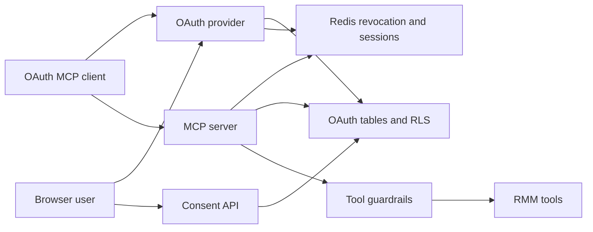

# OAuth and MCP Threat Model

## Executive summary

OAuth/MCP introduces a new production-bound automation boundary where external clients can receive refresh tokens, call MCP resources/tools, and potentially execute RMM actions without the interactive UI approval loop. The most important risk themes are overly broad OAuth scopes, public-client refresh token abuse, revocation dependence on Redis, tenant metadata mistakes during consent/token minting, unauthenticated bootstrap abuse, and production MCP execute allowlist drift. Existing controls are substantial: PKCE, EdDSA JWT access tokens, 10-minute access-token TTL, persisted sessions/grants, fail-closed grant metadata persistence, Redis-backed jti/grant revocation checks, partner membership checks at consent, MCP scope/tier gates, production tool allowlists, payment gating for bootstrap auth tools, and RLS policies on OAuth tables.

## Scope and assumptions

- In scope:
  - `apps/api/src/routes/oauth.ts`
  - `apps/api/src/routes/oauthInteraction.ts`
  - `apps/api/src/routes/oauthWellKnown.ts`
  - `apps/api/src/routes/connectedApps.ts`
  - `apps/api/src/routes/mcpServer.ts`
  - `apps/api/src/middleware/bearerTokenAuth.ts`
  - `apps/api/src/oauth`
  - `apps/api/src/modules/mcpBootstrap`
  - OAuth schema/migrations in `apps/api/src/db/schema/oauth.ts` and `apps/api/migrations/2026-04-24-*oauth*.sql`
- Out of scope: non-MCP AI chat UI except shared tool tiering/guardrails; non-OAuth API-key MCP is in scope only as a comparison/control path.
- User-confirmed deployment context: DigitalOcean droplet with Docker, Caddy, and Cloudflare proxy.
- User-confirmed launch context: OAuth/MCP is new and should be treated as production once reviews complete.
- Open questions:
  - What exact production values will be used for `MCP_EXECUTE_TOOL_ALLOWLIST` and `MCP_REQUIRE_EXECUTE_ADMIN`?
  - Will Cloudflare add path-specific WAF/rate limits for `/oauth/*` and `/api/v1/mcp/*`?
  - Will OAuth clients be limited to known first-party clients initially, or is open dynamic client registration required at launch?
- Testing note for later:
  - Before production enablement, explicitly test `MCP_OAUTH_ENABLED=true` with Redis up/down: startup must fail when Redis is unavailable, connected-app delete and token revocation should return clear `503`s during Redis outage, and existing bearer-token revocation checks should fail closed.
  - Destructive MCP tool execution now requires `ai:execute_admin` by default when `NODE_ENV=production`; test API-key and OAuth MCP clients against tier-3 tools with `MCP_REQUIRE_EXECUTE_ADMIN` unset, `true`, and `false`.
  - OAuth token exchange is now rate-limited by both source IP and `client_id`, and bodies over 64 KiB are rejected; test `/oauth/token` with normal clients, missing `client_id`, repeated refresh/code exchanges, Redis unavailable, and oversized form bodies.
  - Dynamic client registration and registration-management updates now pre-validate metadata before `oidc-provider` persistence; test normal public-client DCR, oversized registration JSON, more than 10 redirect URIs, long `client_name`, unsupported scopes, confidential auth methods, unsupported grant/response types, remote key/request metadata, registration-management update/delete paths, and standard MCP desktop/browser redirect URI formats.
  - Dynamic client registration now defaults off when `NODE_ENV=production` unless `OAUTH_DCR_ENABLED=true`; test closed-launch production behavior returns `registration_disabled`, and test first-party/manual client registration flow or explicit DCR enablement before onboarding real MCP clients.
  - New OAuth refresh tokens now expire after 14 days, aligned with Grant/Session TTL; test connector re-auth behavior after refresh-token expiry and confirm existing persisted refresh tokens are handled according to their stored expiry.
  - Consent UI now distinguishes `mcp:write` from high-risk `mcp:execute`; test that clients requesting `mcp:execute` show the red high-risk copy and that `mcp:write` alone does not imply command/script execution.
  - In production, test `TRUST_PROXY_HEADERS=true/false` behind Cloudflare/Caddy; OAuth rate-limit keys and MCP bootstrap audit context should trust proxy headers only when explicitly enabled and otherwise use the direct remote address fallback.
  - Test MCP SSE/message behavior across OAuth access-token refresh: messages posted with a refreshed access token from the same grant should still match the existing SSE session, while a different OAuth grant should not share the session/rate-limit bucket.
  - Before deploy, validate the exact production `OAUTH_JWKS_PRIVATE_JWK`: startup should fail for missing/duplicate `kid`, public-only JWKs, non-Ed25519 keys, or non-EdDSA metadata; existing valid keys generated by `apps/api/scripts/oauth-gen-keys.ts` should still start cleanly.
  - OAuth provider JWA is now EdDSA-only to match the enforced Ed25519 signing keys; test DCR/client metadata that attempts RS256 or other signing algorithms is rejected or fails before token minting.
  - Consent POST now validates body shape before DB/grant work; test malformed JSON, non-boolean `approve`, and non-UUID `partner_id` return `400`.
  - Connected-app listing now omits disabled OAuth clients; test that revoking an app removes it from Settings while provider lookup continues to reject the disabled client.
  - MCP JSON-RPC message bodies now have a 64 KiB route-level cap in addition to the global API body limit; test oversized unauth bootstrap and authed MCP messages return `413`.
  - Caddy now routes `/api/v1/mcp/sse` through the no-compression/no-buffering streaming handler; test MCP SSE connection establishment through Cloudflare/Caddy, including endpoint event delivery and keepalive pings.
  - Bootstrap follow-on tools now require the `bootstrap_secret` returned by `create_tenant`; test that missing/wrong secrets block `verify_tenant` API-key minting and `attach_payment_method` setup URL creation.

## System model

### Primary components

- OAuth provider: `oidc-provider` mounted under `/oauth` when `MCP_OAUTH_ENABLED=true`, configured in `apps/api/src/oauth/provider.ts`.
- OAuth bridge/rate limits/revocation pre-handler: `apps/api/src/routes/oauth.ts`.
- OAuth persistence adapter: `apps/api/src/oauth/adapter.ts` persists clients, authorization codes, refresh tokens, sessions, interactions, and grants.
- Consent API: `apps/api/src/routes/oauthInteraction.ts` loads interaction details, checks partner membership, creates grants, and persists Breeze tenant metadata.
- Bearer middleware: `apps/api/src/middleware/bearerTokenAuth.ts` verifies EdDSA JWTs, checks jti/grant revocation, maps OAuth scopes to internal `ai:*` scopes, and sets DB access context.
- MCP server: `apps/api/src/routes/mcpServer.ts` accepts API key or OAuth bearer auth, exposes SSE and JSON-RPC, dispatches tools/resources, and contains bootstrap carve-outs.
- Bootstrap tools: `apps/api/src/modules/mcpBootstrap` exposes unauthenticated pre-activation tools and authenticated post-activation tools gated by payment method.
- OAuth RLS schema: `apps/api/src/db/schema/oauth.ts` and OAuth migrations define persisted OAuth tables and RLS policy coverage.

### Data flows and trust boundaries

- OAuth client -> `/oauth/reg`
  - Data: dynamic client registration metadata.
  - Channel: HTTPS through Cloudflare/Caddy/API.
  - Guarantees: endpoint rate limited by IP; DCR clients are public unless metadata config says otherwise.
  - Validation: `oidc-provider` validation and persisted `oauth_clients` adapter row.

- Browser/user -> `/oauth/auth` -> consent UI -> `/api/v1/oauth/interaction/:uid/consent`
  - Data: authorization request, resource indicator, requested scopes, logged-in Breeze JWT, selected `partner_id`.
  - Channel: browser redirects and HTTPS JSON.
  - Guarantees: PKCE required, interaction UID TTL, JWT auth required for interaction API, resource indicator must match `OAUTH_RESOURCE_URL`, partner membership checked before grant creation.
  - Validation: membership check in `oauthInteraction.ts`; grant metadata persisted via `setGrantBreezeMeta`.

- OAuth client -> `/oauth/token`
  - Data: authorization code or refresh token exchange.
  - Channel: HTTPS form post.
  - Guarantees: token endpoint IP rate limit; access tokens are JWTs with 10-minute TTL; refresh tokens persisted; grant metadata lookup fails closed if tenancy cannot be resolved.
  - Validation: `oidc-provider`; `buildExtraTokenClaims` refuses null-tenant JWTs.

- OAuth client -> `/api/v1/mcp/message` or `/api/v1/mcp/sse`
  - Data: bearer JWT, JSON-RPC method, tool/resource params, SSE session ID.
  - Channel: HTTPS/SSE.
  - Guarantees: bearer middleware verifies issuer/audience/signature; Redis revocation checked; OAuth scopes expanded to internal `ai:*`; MCP tool tiers and production allowlists enforced.
  - Validation: JSON-RPC request shape, tool input Zod schemas, RBAC checks, tool rate limits, RLS DB context.

- User/admin -> connected apps delete
  - Data: client ID for connected app.
  - Channel: JWT-authenticated HTTPS.
  - Guarantees: partner-scoped lookup; refresh tokens marked revoked; jti and grant revocation cache writes attempted and failures surface as `503`.
  - Validation: partner ID match and DB/RLS context.

- Unauthenticated client -> MCP bootstrap tools
  - Data: create/verify tenant, attach payment method bootstrap inputs.
  - Channel: HTTPS JSON-RPC without API key only when `MCP_BOOTSTRAP_ENABLED=true`.
  - Guarantees: middleware only permits whitelisted methods/tools; handlers use Zod input schemas; `create_tenant` returns a one-time bootstrap secret whose hash is stored in partner settings; `verify_tenant` and `attach_payment_method` require that secret; authenticated follow-on tools require API key and payment method.
  - Validation: bootstrap module startup checks and per-tool schemas.

#### Diagram

## Assets and security objectives

| Asset | Why it matters | Security objective (C/I/A) |
| --- | --- | --- |
| OAuth refresh tokens | 14-day bearer capability for MCP access | C/I |
| OAuth JWT access tokens | Direct bearer access to MCP server | C/I |
| OAuth private JWK | Signing key compromise mints arbitrary tokens | C/I |
| Grant tenant metadata | Determines partner/org claim in access JWTs | I |
| Dynamic client metadata | Controls client identity and token lifecycle | I |
| MCP API keys / OAuth mapped scopes | Authorize external automation | C/I |
| MCP tool allowlist and tier map | Controls destructive RMM action exposure | I |
| SSE session IDs | Route async JSON-RPC responses to correct client | C/I |
| Bootstrap tenant/payment state and bootstrap secret | Creates tenants and first API keys | C/I |
| OAuth audit/error logs | Needed to detect abuse and failed revocations | I/A |

## Attacker model

### Capabilities

- Internet attacker can reach `/oauth/*`, `/.well-known/*`, and `/api/v1/mcp/*` through Cloudflare/Caddy.
- Malicious public OAuth client can register via DCR if registration remains enabled.
- Attacker can phish or steal an OAuth refresh token, API key, or browser JWT.
- Authenticated Breeze user can attempt to consent an OAuth client against a partner they should not control.
- Compromised MCP client can issue high-volume JSON-RPC calls or invoke all tools permitted by its scopes and allowlist.
- Redis outage or failure can affect revocation checks and MCP rate limits.

### Non-capabilities

- OAuth access JWTs must verify against `OAUTH_ISSUER`, `OAUTH_RESOURCE_URL`, and EdDSA public JWKS.
- A user cannot consent for a partner unless `partnerUsers` membership exists.
- OAuth bearer tokens do not grant `ai:execute_admin`; the middleware maps `mcp:read`, `mcp:write`, and explicit `mcp:execute`.
- Tier-3 MCP tools are blocked in production unless listed in `MCP_EXECUTE_TOOL_ALLOWLIST`.
- Bootstrap tools are unavailable unless `MCP_BOOTSTRAP_ENABLED=true` and are limited to whitelisted JSON-RPC methods.

## Entry points and attack surfaces

| Surface | How reached | Trust boundary | Notes | Evidence (repo path / symbol) |
| --- | --- | --- | --- | --- |
| OAuth dynamic registration | `POST /oauth/reg` | Internet -> OAuth provider | DCR defaults off in production unless `OAUTH_DCR_ENABLED=true`; IP rate-limited | `apps/api/src/routes/oauth.ts`, `apps/api/src/oauth/provider.ts` |
| OAuth authorize | `GET/POST /oauth/auth` | Browser/client -> OAuth provider | PKCE required, rate-limited | `apps/api/src/oauth/provider.ts` |
| OAuth token | `POST /oauth/token` | Client -> token issuer | Access JWT + refresh token issuance | `apps/api/src/oauth/provider.ts`, `apps/api/src/oauth/adapter.ts` |
| OAuth revocation | `POST /oauth/token/revocation` | Client -> revocation cache/adapter | JWT pre-handler and oidc-provider bridge | `apps/api/src/routes/oauth.ts`, `apps/api/src/oauth/revocationCache.ts` |
| OAuth JWKS | `/.well-known/jwks.json`, `/oauth/jwks` | Internet -> public key material | Private fields stripped | `apps/api/src/oauth/keys.ts`, `apps/api/src/routes/oauthWellKnown.ts` |
| Consent details | `GET /api/v1/oauth/interaction/:uid` | JWT user -> consent API | Lists partner memberships | `apps/api/src/routes/oauthInteraction.ts` |
| Consent approval | `POST /api/v1/oauth/interaction/:uid/consent` | JWT user -> grant creation | Partner membership checked; grant metadata persisted | `apps/api/src/routes/oauthInteraction.ts`, `apps/api/src/oauth/adapter.ts` |
| Connected apps delete | `DELETE /api/v1/settings/connected-apps/:clientId` | JWT partner user -> revocation | Disables client, revokes tokens/grant | `apps/api/src/routes/connectedApps.ts` |
| MCP SSE | `GET /api/v1/mcp/sse` | API key/OAuth -> long-lived SSE | Per-key caps and production Redis rate limit | `apps/api/src/routes/mcpServer.ts` |
| MCP JSON-RPC | `POST /api/v1/mcp/message` | API key/OAuth/bootstrap -> tool dispatch | Tool/resource calls, scope/tier/allowlist checks | `apps/api/src/routes/mcpServer.ts` |
| MCP bootstrap | `POST /api/v1/mcp/message` without auth | Unauth -> tenant bootstrap | Only whitelisted tools when enabled; follow-on calls require bootstrap secret | `apps/api/src/routes/mcpServer.ts`, `apps/api/src/modules/mcpBootstrap` |

## Top abuse paths

1. **Broad execute scope abuse:** attacker registers/controls an OAuth client, obtains user consent for `mcp:execute`, and uses MCP to execute tier-3 RMM tools that are present in `MCP_EXECUTE_TOOL_ALLOWLIST`.
2. **Refresh token theft:** attacker steals a 14-day refresh token from an MCP client machine and continuously refreshes MCP access until connected app deletion, grant revocation, or token expiry.
3. **Revocation blind spot:** operator deletes a connected app while Redis is unavailable; if any revocation cache write does not fail closed, existing access JWTs could survive until natural expiry.
4. **Tenant metadata confusion:** consent creates a grant without durable partner/org metadata, token minting emits null or wrong tenant claims, and bearer middleware gives either broken auth or wrong tenant DB context.
5. **DCR/client spam:** if DCR is explicitly enabled, unauthenticated attacker floods dynamic registration/token/authorization endpoints, consuming DB rows or degrading OAuth availability.
6. **Bootstrap tenant abuse:** unauthenticated client invokes pre-activation bootstrap tools repeatedly to create/verify tenants or start payment flows, exhausting resources or polluting onboarding state.
7. **SSE session resource exhaustion:** compromised key/client opens many SSE sessions and messages, exhausting in-memory MCP session queues or worker capacity.
8. **Scope mapping mismatch:** OAuth `mcp:write` and `mcp:execute` must stay distinct, or clients may receive more powerful tool classes than the consenting user expects.

## Threat model table

| Threat ID | Threat source | Prerequisites | Threat action | Impact | Impacted assets | Existing controls (evidence) | Gaps | Recommended mitigations | Detection ideas | Likelihood | Impact severity | Priority |
| --- | --- | --- | --- | --- | --- | --- | --- | --- | --- | --- | --- | --- |
| TM-001 | Malicious OAuth/MCP client or stolen OAuth token | User consents to `mcp:execute`; production allowlist includes tier-3 tools | Calls destructive MCP tools such as command/script/file/device actions | Remote endpoint compromise or large tenant state changes through external automation | MCP scopes, RMM tools, devices | OAuth `mcp:write` and `mcp:execute` are now distinct; tier checks, RBAC, guardrails, rate limits, and `MCP_EXECUTE_TOOL_ALLOWLIST` in `mcpServer.ts`; `ai:execute_admin` is required by default for production tier-3 calls and is not granted by OAuth in `bearerTokenAuth.ts` | MCP auto-executes tier-3 tools based on scope/allowlist/admin gate; no interactive approval loop | Launch with empty/minimal `MCP_EXECUTE_TOOL_ALLOWLIST`; keep `MCP_REQUIRE_EXECUTE_ADMIN` at its production default; keep destructive OAuth scopes opt-in | Audit `mcp.tools.call`, actor id prefix `oauth:`, tier-3 tool names, allowlist/admin-gate changes | medium | critical | critical |
| TM-002 | Attacker with stolen refresh token | Refresh token copied from client host or logs | Exchanges token for repeated 10-minute access JWTs | External MCP access until revocation/expiry | Refresh tokens, access JWTs, tenant data | Refresh tokens persisted with expiry/revokedAt; new refresh tokens expire after 14 days; revoked refresh-token lookups emit `OAUTH_REFRESH_TOKEN_REUSE`; access tokens TTL 600s; bearer verifies issuer/audience/signature and revocation | Public clients cannot keep secrets; refresh token theft remains useful inside the 14-day window | Add new-IP/UA anomaly detection and alerting thresholds for `OAUTH_REFRESH_TOKEN_REUSE`; consider device-bound tokens if practical | Token exchange from new IP/UA, high refresh frequency, repeated invalid_grant, `OAUTH_REFRESH_TOKEN_REUSE` | medium | high | high |
| TM-003 | OAuth client or operator during revocation | Redis unavailable or revocation write fails | Existing access JWT continues after revoke/delete | Residual MCP access after user believes app disconnected | JTI/grant revocation markers, connected apps | `connectedApps.ts` throws `503` on revocation cache write failure; disabled clients are omitted from the connected-app list and rejected by the provider adapter; bearer fails closed on Redis read errors; revocation pre-handler verifies JWT before cache write; `revokeJti`/`revokeGrant` now reject when OAuth is enabled and Redis is missing; startup fails when OAuth is enabled but Redis is unreachable | Redis remains a hard dependency for OAuth availability; operational alerting must catch Redis outages quickly | Keep Redis SLO/alerts high; add runbook for failed connected-app deletion and OAuth revocation 503s | `OAUTH_REVOCATION_CACHE_WRITE_FAILED`, connected-app delete 503s, Redis missing while OAuth enabled | low | high | medium |
| TM-004 | Authenticated user trying to consent wrong tenant | User has Breeze JWT but not target partner membership | Submits arbitrary `partner_id` to consent endpoint | OAuth grant for unauthorized partner | Grant metadata, partner data | Consent route validates body shape, requires UUID `partner_id`, checks `partnerUsers` membership before grant save, and requires the resource indicator to match | Consent UI lists memberships, but POST still intentionally relies on server membership check for authorization | Keep negative tests for non-member partner_id; log denied consent attempts | 400 malformed consent bodies, 403 `not a member of this partner`, partner_id mismatch attempts | low | high | medium |
| TM-005 | Infrastructure failure or process restart | OAuth flow crosses API restart | Session/grant lost or token minted without tenant metadata | Broken auth or wrong/absent tenant context | OAuth sessions/grants, token claims | Sessions/grants now persisted in Postgres; `setGrantBreezeMeta` updates grant row; `buildExtraTokenClaims` throws if partner metadata missing | Recently changed code; migration/RLS drift could regress | Run integration tests for authorize->consent->token->refresh across API restart; db drift/RLS check before launch | OAuth grant metadata lookup failures, token endpoint `server_error` | medium | medium | medium |
| TM-006 | Internet attacker | DCR/authorize/token endpoints public | Floods registration, token, auth, or revocation endpoints | OAuth DB growth or auth availability degradation | OAuth tables, API availability | DCR defaults off in production unless `OAUTH_DCR_ENABLED=true`; IP rate limits for `/reg`, registration-management paths, `/token`, `/auth`, `/token/revocation` in `oauth.ts`; `/reg*` has metadata pre-validation and 64 KiB body cap; DCR is narrowed to public PKCE clients (`token_endpoint_auth_method=none`, auth-code/refresh grants, `response_types=["code"]`) and rejects remote JWKS/request/sector metadata on create/update; `/token` also has a cloned-body `client_id` limiter and 64 KiB body cap; OAuth now uses the shared trusted-client-IP helper so forwarded headers are ignored in production unless `TRUST_PROXY_HEADERS` explicitly enables them; global rate limit also applies | If `OAUTH_DCR_ENABLED=true`, DCR is still public; source attribution still depends on Cloudflare/Caddy forwarding the intended remote IP when proxy trust is enabled | Keep production DCR disabled for a closed launch or add Cloudflare WAF/rate rules for `/oauth/*`; cap active clients per IP/user before launch | DCR disabled responses, DCR volume/rejections, token 429s by IP/client, Cloudflare rate events, OAuth table growth | medium | medium | medium |
| TM-007 | Unauthenticated bootstrap abuser | `MCP_BOOTSTRAP_ENABLED=true` | Calls allowed pre-activation tools repeatedly or tries guessed tenant IDs | Tenant/payment/onboarding resource abuse or unauthorized first API-key retrieval | Partners, activations, provisioning API keys, bootstrap secret | Middleware only permits initialize/tools/list and named bootstrap tools; 64 KiB MCP JSON-RPC body cap before bootstrap parsing; Zod schemas; startup checks; `create_tenant`, `verify_tenant`, and `attach_payment_method` have Redis-backed rate limits; `verify_tenant` and `attach_payment_method` require the one-time `bootstrap_secret` returned by `create_tenant` and stored only as a hash | Abuse impact still depends on Cloudflare perimeter controls and business rules; bootstrap secret must be stored by the MCP client because it is shown once | Keep per-IP/per-domain/per-tenant bootstrap quotas tuned; require CAPTCHA/Cloudflare challenge for unauth bootstrap if exposed broadly | Tenant creation attempts by IP/email/domain, invalid bootstrap secret errors, payment attach attempts, bootstrap rate-limit errors | medium | medium | medium |
| TM-008 | Compromised API key/OAuth client | Valid `ai:read` or mapped read scope | Opens many SSE sessions/message loops or sends large JSON-RPC requests | MCP memory/CPU exhaustion, delayed responses | MCP session queues, API memory | `MAX_SSE_SESSIONS`, per-principal cap, production Redis rate limits for SSE/messages, 64 KiB MCP JSON-RPC body cap; OAuth bearer contexts preserve `grant_id`, and MCP uses a stable `oauth-grant:<id>` key for session ownership and message/SSE limits instead of rotating access-token `jti`s; Caddy routes `/api/v1/mcp/sse` through the streaming no-buffer handler | In-memory SSE queues are per-process and not distributed; caps are global constants; Cloudflare SSE behavior still needs live-path testing | Tune caps for droplet size; Cloudflare rate rules; expose MCP session metrics | Active SSE count, per-principal session cap hits, message 429s, MCP 413s, SSE disconnects/keepalive failures | medium | medium | medium |
| TM-009 | Key/config leak attacker | `OAUTH_JWKS_PRIVATE_JWK` exposed from env/droplet | Signs arbitrary access JWTs | Full OAuth bearer impersonation within accepted claim shape | OAuth signing key, MCP tools | Private JWK loaded only from env; public JWKS strips private fields in `keys.ts`; JWKS loader now fails startup for empty sets, missing/duplicate `kid`, public-only keys, non-Ed25519 keys, or non-EdDSA metadata; OAuth provider JWA is EdDSA-only to match the enforced signing key type | Droplet/env compromise remains catastrophic; no key rotation process in code | Store private JWK in a secret manager or protected `.env`; document and test OAuth key rotation; alert on env access | Unexpected JWT `kid`, failed signature spikes, config file access monitoring | low | critical | high |
| TM-010 | Developer/operator misconfiguration | Broad OAuth scopes and allowlist enabled by default | Exposes unintended tool classes to external clients | Unclear consent semantics and overprivileged automation | OAuth scopes, MCP tools | `ai:execute_admin` is intentionally API-key-only and required by default in production; production allowlist blocks tier-3 unless configured; OAuth now separates `mcp:write` from `mcp:execute`; consent UI labels `mcp:execute` as high-risk device actions | External client setup must clearly explain when `mcp:execute` is requested; explicitly setting `MCP_REQUIRE_EXECUTE_ADMIN=false` reopens the lower-friction execute path | Keep `mcp:execute` separate from `mcp:write`; require explicit admin approval for execute | Scope distribution in grants, tool calls by scope, consent audit review | medium | high | high |

## Criticality calibration

- Critical: external OAuth/MCP path can execute destructive RMM tools across devices or mint arbitrary accepted tokens.
  - Examples: leaked private JWK; broad `mcp:execute` plus permissive execute allowlist; token claim bug that grants wrong partner/org.
- High: long-lived external MCP access, residual access after revocation, OAuth token theft, or unauthorized partner consent.
  - Examples: stolen refresh token; Redis revocation gap; connected app delete partially succeeds.
- Medium: availability/resource abuse or constrained bootstrap pollution.
  - Examples: DCR spam, SSE session exhaustion, bootstrap tenant spam.
- Low: malformed OAuth requests that fail closed or low-sensitivity metadata exposure.
  - Examples: invalid resource indicator, expired interaction UID.

## Focus paths for security review

| Path | Why it matters | Related Threat IDs |
| --- | --- | --- |
| `apps/api/src/routes/oauth.ts` | Public OAuth bridge, endpoint rate limits, revocation JWT pre-handler | TM-002, TM-003, TM-006 |
| `apps/api/src/services/clientIp.ts` | Trusted proxy-header handling for OAuth and MCP request attribution | TM-006, TM-007 |
| `apps/api/src/oauth/provider.ts` | PKCE, scopes, TTLs, resource indicators, token claims, DCR behavior | TM-001, TM-002, TM-005, TM-010 |
| `apps/api/src/oauth/adapter.ts` | OAuth persistence, grant metadata, token consume/destroy/revoke semantics | TM-002, TM-003, TM-005 |
| `apps/api/src/oauth/revocationCache.ts` | Redis-backed jti/grant revocation fail-open/fail-closed behavior | TM-003 |
| `apps/api/src/oauth/keys.ts` | Private/public JWK handling and leakage prevention | TM-009 |
| `apps/api/src/oauth/keys.test.ts` | JWKS shape validation and private-key/public-JWKS regression coverage | TM-009 |
| `apps/api/src/middleware/bearerTokenAuth.ts` | JWT validation, scope mapping, DB context for OAuth callers | TM-001, TM-004, TM-010 |
| `apps/api/src/routes/oauthInteraction.ts` | Consent partner selection, membership checks, grant metadata durability | TM-004, TM-005 |
| `apps/api/src/routes/connectedApps.ts` | Connected-app deletion and token/grant revocation | TM-003 |
| `apps/api/src/routes/mcpServer.ts` | MCP auth, bootstrap carve-out, scope/tier gates, allowlist, SSE/message handling | TM-001, TM-007, TM-008, TM-010 |
| `apps/api/src/modules/mcpBootstrap` | Unauthenticated bootstrap and payment-gated activation tools | TM-007 |
| `apps/api/src/services/aiGuardrails.ts` | Tool tiering, RBAC mapping, per-tool rate limits | TM-001, TM-010 |
| `apps/api/src/services/aiToolSchemas.ts` | Zod schemas for MCP/AI tool input validation | TM-001 |
| `apps/api/src/db/schema/oauth.ts` | OAuth table shape, token/grant metadata columns | TM-005 |
| `apps/api/migrations/2026-04-24-oauth-sessions-grants.sql` | Session/grant persistence and RLS policies | TM-005 |
| `apps/api/migrations/2026-04-24-oauth-z-org-axis-coverage.sql` | Org-axis policy coverage for OAuth tables | TM-004, TM-005 |
| `docker-compose.yml` | OAuth secrets, Redis requirement, public deployment topology | TM-003, TM-009 |
| `docker/Caddyfile.prod` | Routing for `/oauth/*`, well-known, and `/api/v1/mcp/*`; MCP SSE no-buffer streaming path | TM-006, TM-008 |

## Quality check

- Covered discovered entry points: DCR, authorize, token, revocation, JWKS, consent, connected-app deletion, MCP SSE/message, unauth bootstrap.
- Covered each trust boundary at least once in threats: internet/OAuth provider, browser consent/API, bearer token/MCP, MCP/tool dispatch, Redis revocation/rate limit, Postgres/RLS.
- Runtime vs CI/dev separation: report focuses on production OAuth/MCP runtime.
- User clarifications reflected: DigitalOcean Docker + Caddy + Cloudflare deployment and production-bound OAuth/MCP feature.
- Assumptions and open questions explicit above.
